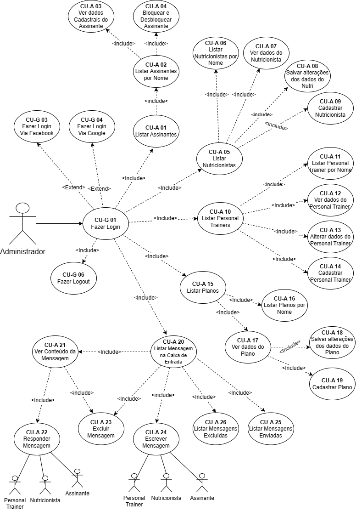
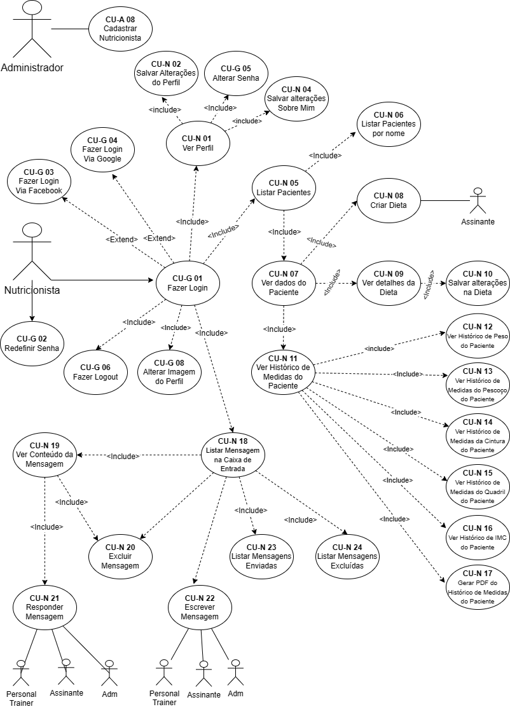
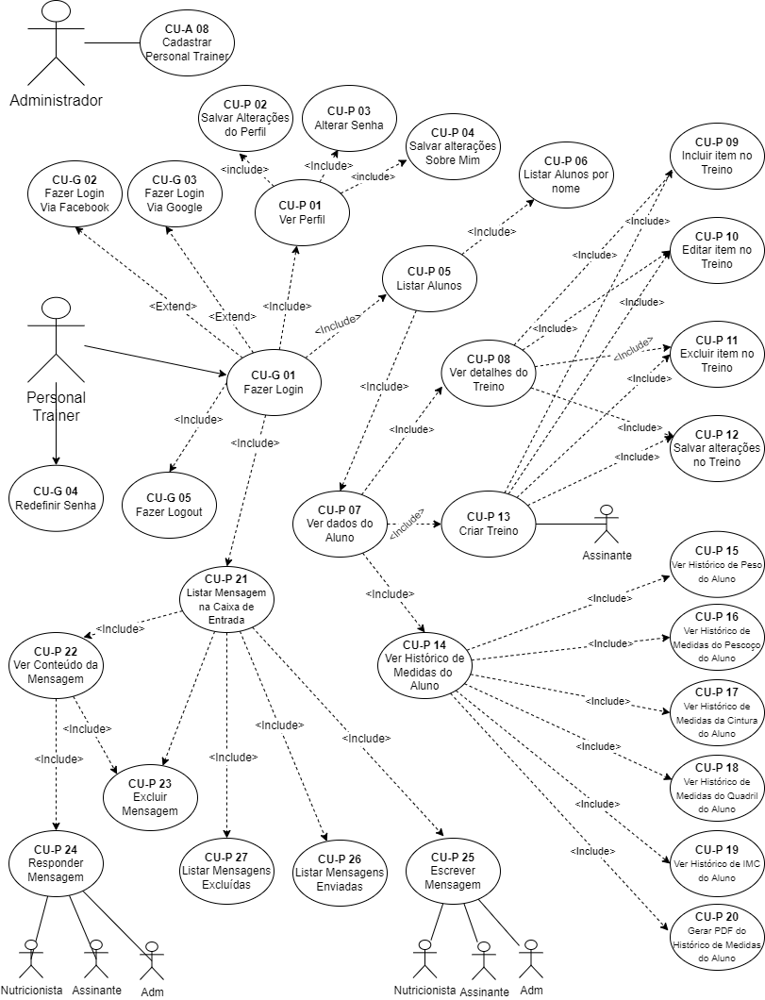
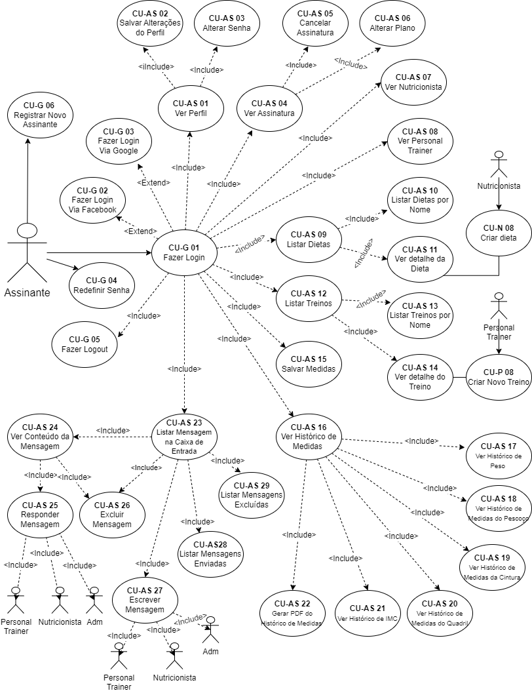
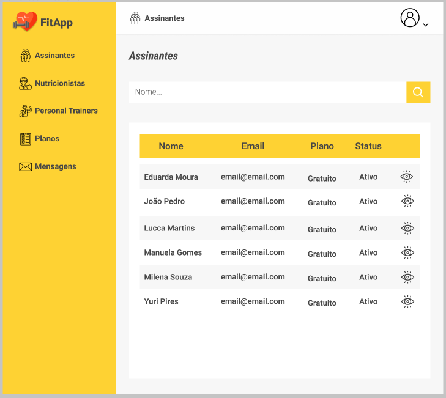
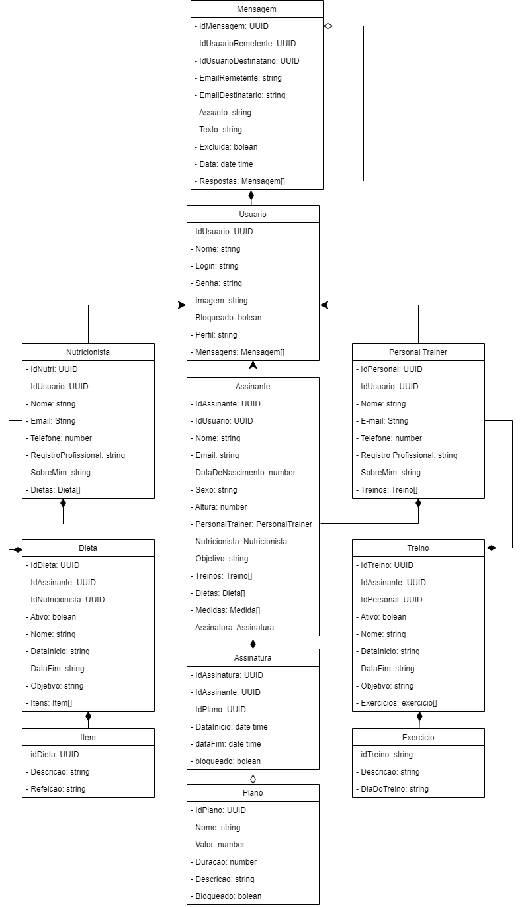
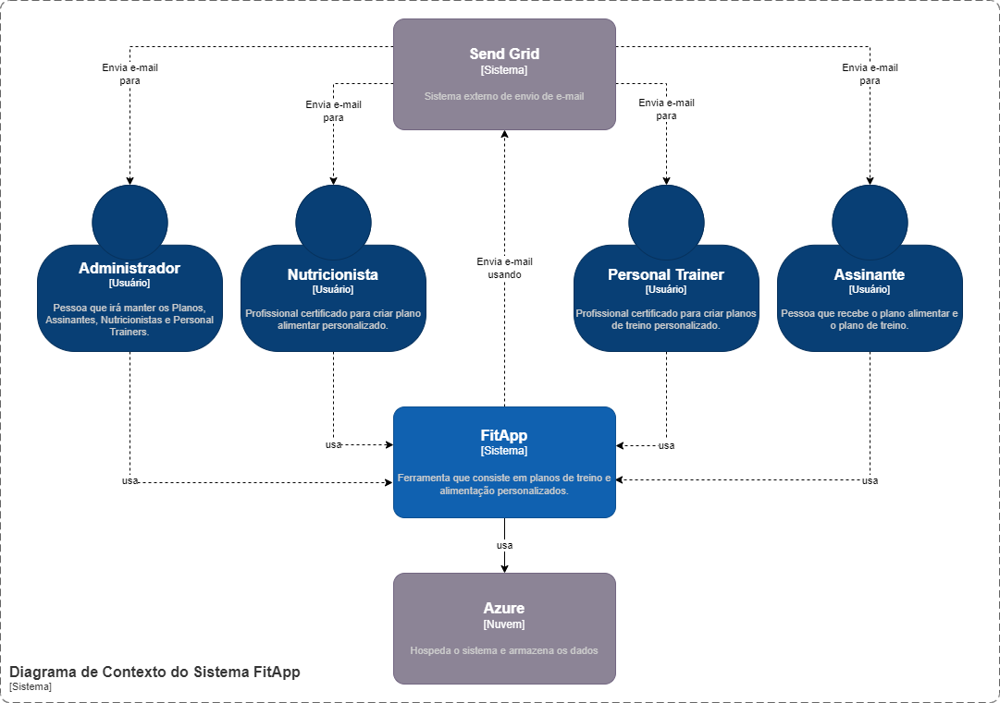
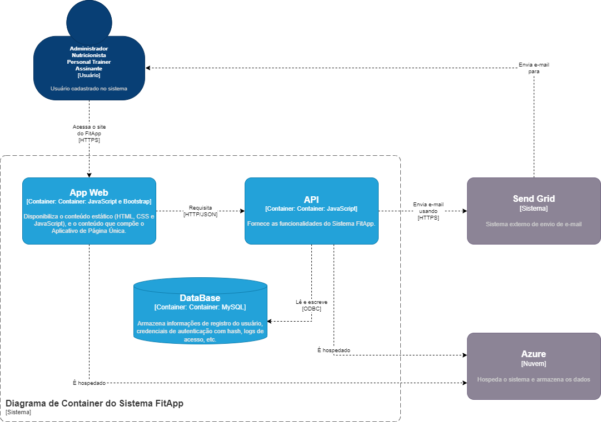
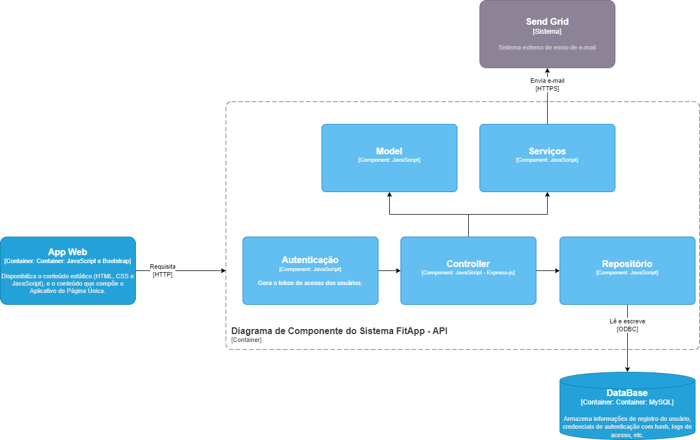

# FitApp
#### Projeto de Conclusão do Curso de Pós Graduação Full Stack Development PUC-Minas
 
## Contexto

Independentemente do gênero, idade e condição socioeconómica, a melhoria ou manutenção de bons níveis de saúde e consequentemente da nossa qualidade de vida são objetivos comuns a todos nós.
É importante lembrar que ser saudável não significa apenas à ausência de doenças, mas também, a um bem-estar geral. Neste sentido, aliar uma alimentação saudável à prática de exercício físico nos ajuda a promover por mais tempo a saúde e bem-estar.
No entanto, com a correria dos dias de hoje, a desculpa da falta de tempo passa sempre a atividade física para segundo plano. Sem contar com o stress diário que nos leva a buscar saídas rápidas e erradas, em relação a alimentação.
Com isso, seguir um estilo de vida saudável tornou-se um dos maiores desafios da vida moderna. Por isso, a existência de uma ferramenta que consiste em planos de treino e alimentação totalmente personalizados, facilita e motiva a melhorar a qualidade de vida e bem-estar.
A figura a seguir, apresenta o método Lean Canvas para descrever o contexto e detalhes da ferramenta de forma prática e objetiva.

## Público alvo

Essa ferramenta irá ajudar todas as pessoas, a partir dos 16 anos, que querem adotar um estilo de vida mais saudável com a união de bons hábitos alimentares e à prática de exercícios físicos.

## Requisitos Funcionais

1. Gestão de conta

    * CU-G 01 - Fazer login
    * CU-G 02 - Fazer login via Facebook
    * CU-G 03 - Fazer login via Google
    * CU-G 04 - Redefinir senha
    * CU-G 05 - Fazer logout
    * CU-G 06 - Registrar novo Assinante

1. Administrador

    * CU-A 01 - Listar Assinantes
    * CU-A 02 - Listar Assinantes por nome
    * CU-A 03 - Ver dados cadastrais do Assinante
    * CU-A 04 - Bloquear e desbloquear Assinante
    * CU-A 05 - Listar Nutricionistas
    * CU-A 06 - Listar Nutricionistas por nome
    * CU-A 07 - Ver dados do Nutricionista
    * CU-A 08 - Salvar alterações dos dados do Nutricionista
    * CU-A 09 - Cadastrar Nutricionista
    * CU-A 10 - Listar Personal Trainers
    * CU-A 11 - Listar Personal Trainers por nome
    * CU-A 12 - Ver dados do Personal Trainer
    * CU-A 13 - Salvar alterações dos dados do Personal Trainers
    * CU-A 14 - Cadastrar Personal Trainers
    * CU-A 15 - Listar Planos
    * CU-A 16 - Listar planos pelo nome
    * CU-A 17 - Ver dados do plano
    * CU-A 18 - Salvar alterações dos dados do plano
    * CU-A 19 - Cadastrar plano
    * CU-A 20 - Listar mensagens na caixa de entrada
    * CU-A 21 - Ver conteúdo da mensagem 
    * CU-A 22 - Responder mensagem
    * CU-A 23 - Excluir mensagem 
    * CU-A 24 - Escrever mensagem
    * CU-A 25 - Listar mensagens enviadas
    * CU-A 26 - Listar mensagens excluídas

1. Nutricionista

    * CU-N 01 - Ver perfil
    * CU-N 02 - Salvar alterações do perfil
    * CU-N 03 - Alterar Senha
    * CU-N 04 - Listar Pacientes
    * CU-N 05 - Listar Pacientes por nome
    * CU-N 06 - Ver dados do Paciente
    * CU-N 07 - Ver detalhes da dieta 
    * CU-N 08 – Incluir item na dieta
    * CU-N 09 – Editar item na dieta
    * CU-N 10 – Excluir item na dieta
    * CU-N 11 - Salvar alterações na dieta
    * CU-N 12 - Criar Dieta
    * CU-N 13 - Ver Histórico de medidas do Paciente
    * CU-N 14 - Ver histórico de peso do Paciente
    * CU-N 15 - Ver histórico de medida do Pescoço do Paciente
    * CU-N 16 - Ver histórico de medida da cintura do Paciente
    * CU-N 17 - Ver histórico quadril do Paciente
    * CU-N 18 - Ver histórico de IMC do Paciente
    * CU-N 19 - Gerar PDF do histórico de medidas do Paciente
    * CU-N 20 - Listar mensagens na caixa de entrada
    * CU-N 21 - Ver conteúdo da mensagem 
    * CU-N 22 - Responder mensagem
    * CU-N 23 – Excluir mensagem
    * CU-N 24 - Escrever mensagem
    * CU-N 25 - Listar mensagens enviadas
    * CU-N 26 - Listar mensagens excluídas

1. Personal Trainer

    * CU-P 01 - Ver perfil
    * CU-P 02 - Salvar alterações do perfil
    * CU-P 03 - Alterar Senha
    * CU-P 04 - Listar Alunos
    * CU-P 05 - Listar Alunos por nome
    * CU-P 06 - Ver dados do Aluno
    * CU-P 07 - Ver Detalhes do treinos
    * CU-P 08 - Incluir exercicio no treino
    * CU-P 09 - Editar exercicio no treino
    * CU-P 10 - Excluir exercicio do treino
    * CU-P 11 - Salvar alterações no treino
    * CU-P 12 - Criar Treino
    * CU-P 13 - Ver Histórico de medidas do Aluno
    * CU-P 14 - Ver histórico de peso do Aluno
    * CU-P 15 - Ver histórico de medida do Pescoço do Aluno
    * CU-P 16 - Ver histórico de medida da cintura do Aluno
    * CU-P 17 - Ver histórico quadril do Aluno
    * CU-P 18 - Ver histórico de IMC do Aluno
    * CU-P 19 - Gerar PDF do histórico de medidas do Aluno
    * CU-P 20 - Listar mensagens na caixa de entrada
    * CU-P 21 - Ver conteúdo da mensagem 
    * CU-P 22 - Responder mensagem
    * CU-P 23 - Excluir mensagem 
    * CU-P 24 - Escrever mensagem
    * CU-P 25 - Listar mensagens enviadas
    * CU-P 26 - Listar mensagens excluídas

1. Assinante

    * CU-AS 01 - Ver perfil
    * CU-AS 02 - Salvar alterações do perfil
    * CU-AS 03 - Alterar Senha
    * CU-AS 04 - Ver Plano
    * CU-AS 05 - Cancelar plano
    * CU-AS 06 – Alterar Plano
    * CU-AS 07 - Ver Nutricionista
    * CU-AS 08 - Ver Personal Trainer
    * CU-AS 09 - Listar Dietas
    * CU-AS 10 - Listar Dietas por nome
    * CU-AS 11 - Ver detalhes da Dieta
    * CU-AS 12 - Listar Treinos
    * CU-AS 13 - Listar Treinos por Nome
    * CU-AS 14 - Ver detalhe do treino
    * CU-AS 15 - Salvar medidas
    * CU-AS 16 - Ver histórico de Medidas
    * CU-AS 17 - Ver histórico de peso
    * CU-AS 18 - Ver histórico de medida do Pescoço
    * CU-AS 19 - Ver histórico de medida da cintura
    * CU-AS 20 - Ver histórico quadril
    * CU-AS 21 - Ver histórico de IMC
    * CU-AS 22 - Gerar PDF do histórico de medidas
    * CU-AS 23 - Listar mensagens na caixa de entrada
    * CU-AS 24 - Ver conteúdo da mensagem 
    * CU-AS 25 - Responder mensagem
    * CU-AS 26 - Excluir mensagem 
    * CU-AS 27 - Escrever mensagem
    * CU-AS 28 - Listar mensagens enviadas
    * CU-AS 29 - Listar mensagens excluídas

## Requisitos Não Funcionais

* Usabilidade: Interface intuitiva;
* Implementação: O Sistema será desenvolvido na linguagem javaScript
* Portabilidade: Responsividade;

## Diagrama de casos de uso 

1. Administrador
    

1. Nutricionista
   

2. Personal Trainer
   

3. Assinante
   

## Atores 
1. Administrador - Pessoa que irá manter os Planos, Assinantes, Nutricionistas e Personal Trainers, podendo realizar consultas, cadastros, alterações, bloqueios / desbloqueios, e envio de mensagens;
1. Nutricionista - Profissional certificado para criar plano alimentar personalizado, podendo realizar consultas, alterações e envio de mensagens;
1. Personal Trainer - Profissional certificado para criar plano de Treino personalizado, podendo realizar consultas, alterações e envio de mensagens;
1. Assinante - Pessoa que recebe o plano alimentar (Paciente) e o plano de treino (Aluno), podendo realizar consultas, alterações e envio de mensagens;

## Casos de Uso

1. Administrador

    1. CU-G 01 - Logar no Sistema: Administrador faz login no Sistema;
        * Ator Primário: Administrador;
        * Pré-condições: Administrador estar cadastrado para utilização do Sistema;
        * Fluxo Principal:
            1. O Administrador requisita acessar o Sistema;
            1. O Sistema apresenta a tela de login para que sejam inseridos o e-mail e a senha do Administrador;
            1. O Administrador fornece os dados;
            1. O Sistema faz a validação dos dados inseridos e, se forem válidos, loga o Administrador no Sistema;
        * Fluxo Alternativo: 
            1. O Administrador requisita acessar o Sistema através do Facebook – CU-G 02;
            1. O Administrador requisita acessar o Sistema através do Google – CU-G 03;
        * Fluxo de Exceção: Caso a senha ou login estejam incorretos, o Sistema apresenta uma mensagem de erro;
        * Pós-condições: O Administrador efetuou o login;

    1. CU-G 05 – Logout do Sistema: Administrador sai do Sistema;
        * Ator Primário: Administrador;
        * Pré-condições: Administrador estar logado no Sistema;
        * Fluxo Principal:
            1. O Administrador requisita “sair”;
            1. O Sistema faz o logout do Administrador;
            1. O Administrador é direcionado para a página home do site;
        * Pós-condições: O Administrador efetuou o Logout;

    1. CU-A 01 – Listar Assinantes: O Administrador verifica a lista de Assinantes cadastrados no Sistema; 
        * Ator Primário: Administrador;
        * Pré-condições: Administrador estar logado no Sistema;
        * Fluxo Principal:
            1. O Administrador requisita verificar no Sistema a lista de Assinantes cadastrados;
            1. O Sistema apresenta a lista de Assinantes cadastrados;
            1. O Sistema apresenta campo para listar Assinante pelo nome CU-A 02;
            1. O Sistema apresenta a opção de ver dados cadastrais do Assinante CU-A 03;
        * Fluxo Alternativo: 
            1. O Administrador informa o nome do Assinante no campo de pesquisa CU-A 02;
            1. O Sistema apresenta a lista de Assinantes cadastrados pelo nome informado;
            1. O Sistema apresenta a opção de ver dados cadastrais da lista de Assinantes cadastrados pelo nome informado CU-A 03;
        * Pós-condições: O Administrador visualizou a lista de Assinantes cadastrados;

    1. CU-A 03 – Ver dados cadastrais do Assinante: O Administrador verifica os dados cadastrais do Assinante;
        * Ator Primário: Administrador;
        * Pré-condições: 
            1. O Administrador estar logado no Sistema;
            1. O Administrador listar Assinantes cadastrados no Sistema CU-A 01;
        * Fluxo Principal:
            1. O Administrador requisita verificar no Sistema os dados cadastrais do Assinante;
            1. O Sistema apresenta os dados do Assinante (nome, e-mail e status) e dados do plano do Assinante (plano, valor, início e fim do plano);
            1. O Sistema apresenta a opção de bloquear ou desbloquear Assinante CU-A 04;
        * Pós-condições: O Administrador visualizou os dados do Assinante;

    1. CU-A 04 – Bloquear e Desbloquear Assinante: O Administrador bloqueia ou desbloqueia Assinante;
        * Ator Primário: Administrador;
        * Pré-condições: 
            1. O Administrador estar logado no Sistema;
            1. O Administrador listar Assinantes cadastrados no Sistema CU-A 01;
            1. O Administrador ver dados cadastrais do Assinante CU-A 03;
        * Fluxo Principal: O Administrador requisita bloquear ou desbloquear Assinante;
        * Pós-condições: O Administrador bloqueou ou desbloqueou Assinante;

    1. CU-A 05 – Listar Nutricionistas: O Administrador verifica a lista de Nutricionistas cadastrados no Sistema;
        * Ator Primário: Administrador;
        * Pré-condições: Administrador estar logado no Sistema;
        * Fluxo Principal:
            1.	O Administrador requisita verificar no Sistema a lista de Nutricionistas cadastrados;
            2.	O Sistema apresenta a lista de Nutricionistas cadastrados;
            3.	O Sistema apresenta campo listar Nutricionista pelo nome CU-A 06;
            4.	O Sistema apresenta a opção de ver os dados cadastrais do Nutricionista CU-A 07;
            5.  O Sistema apresenta a opção de alterar dados do Nutricionista CU-A 08;
            6.  O Sistema apresenta a opção de cadastrar Nutricionista CU-A 09;
        * Fluxo Alternativo: 
            1.	O Administrador informa o nome do Nutricionista no campo de pesquisa CU-A 06;
            2.	O Sistema apresenta a lista de Nutricionistas cadastrados pelo nome informado;
            3.	O Sistema apresenta a opção de bloquear ou desbloquear Nutricionista CU-A 07;
            4.	O Sistema apresenta a opção de alterar dados do Nutricionista CU-A 08;
            5.  O Sistema apresenta a opção de cadastrar Nutricionista CU-A 09;  
        * Pós-condições: O Administrador visualizou a lista de Nutricionistas cadastrados;

    
    1. CU-A 07 – Ver dados do Nutricionista: O Administrador verifica os dados cadastrais do Nutricionista;
        * Ator Primário: Administrador;
        * Pré-condições: 
            1.	O Administrador estar logado no Sistema;
            2.	O Administrador listar Nutricionistas cadastrados no Sistema CU-A 05;
        * Fluxo Principal: 
            1. O Administrador requisita verificar no Sistema os dados cadastrais do Nutricionista;
            2. O Sistema apresenta os dados do Nutricionista (nome, e-mail, tele-fone, registro profissional e status);
            3. O Sistema apresenta a opção de alterar dados do Nutricionista CU-A 08;
        * Pós-condições: O Administrador visualizou os dados do Nutricionista;

    2. CU-A 08 – Salvar alterações dos dados do Nutricionista: O Administrador altera dados do Nutricionista;
        * Ator Primário: Administrador;
        * Pré-condições: 
            1.	O Administrador estar logado no Sistema;
            2.	O Administrador listar Nutricionistas cadastrados no Sistema CU-A 05;
            3.  O administrador ver dados cadastrais do Nutricionista CU-A 07;
        * Fluxo Principal:
            1.  O Administrador requisita alterar dados cadastrais do Nutricionista;
            2.  O Sistema apresenta a tela de cadastro;
            3.  O Administrador fornece os dados solicitados (nome, e-mail, telefone, registro profissional e status) do Nutricionista e requisita salvar os dados;
            4.  O Sistema faz a validação dos dados inseridos e, se forem válidos, altera os dados;

        * Fluxo de exceção:
            1.	Caso os dados não sejam válidos, o Sistema apresenta uma mensa-gem de erro;
        * Pós-condições: O Administrador alterou os dados cadastrais do Nutricionista;

    3. CU-A 09 – Cadastrar Nutricionista: O Administrador cadastra Nutricionista;
        * Ator Primário: Administrador;
        * Pré-condições: 
            1.	O Administrador estar logado no Sistema;
            2.	O Administrador listar Nutricionistas cadastrados no Sistema CU-A 05;
        * Fluxo Principal:
            1.	O Administrador requisita cadastrar Nutricionista;
            2.	O Sistema apresenta a tela de cadastro;
            3.	O Administrador fornece os dados solicitados (nome, e-mail, telefone e registro profissional) do Nutricionista e requisita salvar os dados;
            4.	O Sistema faz a validação dos dados inseridos e, se forem válidos, cadastra o Nutricionista;
        * Fluxo de exceção:
            1.	Caso os dados não sejam válidos, o Sistema apresenta uma mensa-gem de erro;
            2.	Caso já exista cadastro para o e-mail informado, o Sistema apresenta mensagem de erro;
        * Pós-condições: O Administrador cadastrou Nutricionista;

    4. CU-A 10 – Listar Personal Trainers: O Administrador verifica a lista de Personal Trainers cadastrados no Sistema
        * Ator Primário: Administrador;
        * Pré-condições: Administrador estar logado no Sistema;
        * Fluxo Principal:
            1.	O Administrador requisita verificar no Sistema a lista de Personal Trainers cadastrados;
            2.	O Sistema apresenta a lista de Personal Trainers cadastrados;
            3.	O Sistema apresenta campo para listar Personal Trainer pelo nome CU-A 11; 
            4.	O Sistema apresenta a opção de ver dados cadastrais do Personal Trainer CU-A 12;
            5.	O Sistema apresenta a opção de alterar os dados cadastrais do Personal Trainer CU-A 13;
            6.  O Sistema apresenta a opção de cadastrar Personal Trainer CU-A 14;
        * Fluxo Alternativo: 
            1.	O Administrador informa o nome do Personal Trainer no campo de pesquisa CU-A 11;
            2.	O Sistema apresenta a lista de Personal Trainers cadastrados pelo nome informado;
            3.	O Sistema apresenta a opção de ver dados cadastrais do Personal Trainer CU-A 12;
            4.	O Sistema apresenta a opção de alterar os dados cadastrais do Personal Trainer CU-A 13;
            5.  O Sistema apresenta a opção de cadastrar Personal Trainer CU-A 14;;
        * Pós-condições: O Administrador visualizou a lista de Personal Trainers cadastrados;

    5. CU-A 12 – Ver dados do Personal Trainer: O Administrador verifica os dados cadastrais do Personal Trainer;
        * Ator Primário: Administrador;
        * Pré-condições: 
            1.	O Administrador estar logado no Sistema;
            2.	O Administrador listar Personal Trainers cadastrados no Sistema CU-A 10;
        * Fluxo Principal:
             1. O Administrador requisita verificar no Sistema os dados cadastrais do Personal Trainer;
             2. O Sistema apresenta os dados do Personal Trainer (nome, e-mail, telefone, registro profissional e status);
             3. O Sistema apresenta a opção de alterar dados do Personal Trainer CU-A 13;
        * Pós-condições: O Administrador visualizou os dados do Personal Trainer;

    6. CU-A 13 - Salvar alterações dos dados do Personal Trainer: O Administrador altera os dados do Personal Trainer;
        * Ator Primário: Administrador;
        * Pré-condições:
            1.  O Administrador estar logado no Sistema;
            2.  O Administrador listar Personal Trainers cadastrados no Sistema CU-A 10;
            3.  O Administrador ver dados cadastrais do Personal Trainer CU-A 12;
        * Fluxo Principal:
            1.  O Administrador requisita alterar dados cadastrais do Personal Trainer;
            2.  O Sistema apresenta a tela de cadastro;
            3.  O Administrador fornece os dados solicitados (nome, e-mail, telefone, registro profissional e status) do Personal Trainer e requisita salvar os dados;
            4.  O Sistema faz a validação dos dados inseridos e, se forem válidos, al-tera os dados;
        * Fluxo de exceção:Caso os dados não sejam válidos, o Sistema apresenta uma mensagem de erro;
        * Pós-condições: O Administrador alterou os dados do Personal Trainer;  

    7. CU-A 14 – Cadastrar Personal Trainer: O Administrador cadastra Personal Trainer;
        * Ator Primário: Administrador;
        * Pré-condições: 
            1.	O Administrador estar logado no Sistema;
            2.	O Administrador listar Personal Trainer cadastrados no Sistema CU-A 10;
        * Fluxo Principal:
            1.	O Administrador requisita cadastrar Personal Trainer;
            2.	O Sistema apresenta a tela de cadastro;
            3.	O Administrador fornece os dados solicitados (nome, e-mail, telefone e registro profissional) do Personal Trainer e requisita salvar os dados;
            4.	O Sistema faz a validação dos dados inseridos e, se forem válidos, ca-dastra o Personal Trainer;
        * Fluxo de exceção:
            1.	Caso os dados não sejam válidos, o Sistema apresenta uma mensa-gem de erro;
            2.	Caso já exista cadastro para o e-mail informado, o Sistema apresenta mensagem de erro;
        * Pós-condições: O Administrador cadastrou Personal Trainer;

    8. CU-A 15 – Listar Planos: O Administrador verifica a lista de planos cadastrados;
        * Ator Primário: Administrador;
        * Pré-condições: O Administrador estar logado no Sistema;
        * Fluxo Principal: 
            1.	O AAdministrador requisita verificar no Sistema a lista de Planos cadastrados;
            2.	O Sistema apresenta a lista de Planos cadastrados;
            3.	O Sistema apresenta campo para listar planos pelo nome CU-A 16;
            4.	O Sistema apresenta a opção de ver dados do plano CU-A 17;
            5.	O Sistema apresenta a opção de alterar os dados do plano CU-A 18;
            6.  O Sistema apresenta a opção de cadastrar plano CU-A 19;
        * Fluxo Alternativo: 
            1.	O Administrador informa o nome do plano no campo de pesquisa CU-A 16;
            2.	O Sistema apresenta a lista de planos cadastrados pelo nome informado;
            3.	O Sistema apresenta a opção de ver dados cadastrais da lista de planos cadastrados pelo nome informado CU-A 17;
            4.  O Sistema apresenta a opção de alterar os dados do plano CU-A 18;
            4.	O Sistema apresenta a opção de cadastrar plano CU-A 19;
        * Pós-condições: O Administrador visualizou a lista de planos cadastrados;

    9.  CU-A 17 – Ver dados do Plano: O Administrador verifica os dados cadastrais do plano;
        * Ator Primário: Administrador;
        * Pré-condições: 
            1.	O Administrador estar logado no Sistema;
            2.	O Administrador listar planos cadastrados no Sistema CU-A 15;
        * Fluxo Principal:
            1.	O Administrador requisita verificar no Sistema os dados cadastrais do plano;
            2.	O Sistema apresenta os dados do plano (plano, valor, status e descrição);
            3.	O Sistema apresenta a opção de alterar dados do plano CU-A 18;
        * Pós-condições: O Administrador visualizou os dados do plano;

    10. CU-A 18 – Salvar alterações dos dados do Plano: O Administrador altera dados do plano;
        * Ator Primário: Administrador;
        * Pré-condições: 
            1.	O Administrador estar logado no Sistema;
            2.	O Administrador listar planos cadastrados no Sistema CU-A 15;
            3.	O Administrador ver dados cadastrais do plano CU-A 17;
        * Fluxo Principal:
            1.	O Administrador requisita alterar dados cadastrais do plano;
            2.	O Sistema apresenta a tela de cadastro;
            3.	O Administrador fornece os dados solicitados (plano, valor, status e descrição) do plano e requisita salvar os dados;
            4.	O Sistema faz a validação dos dados inseridos e, se forem válidos, altera o plano;
        * Fluxo de exceção: Caso os dados não sejam válidos, o Sistema apresenta uma mensagem de erro;
        * Pós-condições: O Administrador alterou os dados do plano;

    11. CU-A 19 – Cadastrar Plano: O Administrador cadastra plano;
        * Ator Primário: Administrador;
        * Pré-condições: 
            1.	O Administrador estar logado no Sistema;
            2.	O Administrador listar planos cadastrados no Sistema CU-A 15;
        * Fluxo Principal:
            1.	O Administrador requisita cadastrar plano;
            2.	O Sistema apresenta a tela de cadastro;
            3.	O Administrador fornece os dados solicitados (plano, valor, status e descrição) do plano e requisita salvar os dados;
            4.	O Sistema faz a validação dos dados inseridos e, se forem válidos, cadastra o plano;
        * Fluxo de exceção: Caso os dados não sejam válidos, o Sistema apresenta uma mensagem de erro;
        * Pós-condições: O Administrador cadastrou plano;

    12. CU-A 20 – Listar mensagens na Caixa de Entrada: O Administrador lista as mensagens da caixa de entrada;
        * Ator Primário: Administrador;
        * Pré-condições: O Administrador estar logado no Sistema;
        * Fluxo Principal:
            1.	O Administrador requisita verificar no Sistema a lista de mensagens;
            2.	O Sistema apresenta a lista de mensagens da caixa de entrada;
            3.	O Sistema apresenta a opção de ver conteúdo da mensagem CU-A 21;
            4.	O Sistema apresenta a opção de responder mensagem CU-A 22;
            5.	O Sistema apresenta a opção de excluir mensagem CU-A 23;
            6.	O Sistema apresenta a opção de escrever mensagem CU-A 24;
            7.	O Sistema apresenta a opção de listar mensagens enviadas CU-A 25;
            8.	O Sistema apresenta a opção de listar mensagens excluídas CU-A 26;
        * Pós-condições: O Administrador visualizou as mensagens da caixa de entrada;

    13. CU-A 21 – Ver conteúdo da mensagem: O Administrador visualiza o conteúdo da mensagem;
        * Ator Primário: Administrador;
        * Pré-condições:
            1.	O Administrador estar logado no Sistema;
            2.	O Administrador listar mensagem na caixa de entrada
        * Fluxo Principal:
            1.	O Administrador requisita verificar o conteúdo da mensagem;
            2.	O Sistema apresenta tela com o conteúdo da mensagem;
            3.	O Sistema apresenta a opção de responder mensagem CU-A 22; 
            4.	O Sistema apresenta a opção de excluir mensagem CU-A 23;
        * Pós-condições: O Administrador visualizou as mensagens da caixa de entrada;

    14. CU-A 22 – Responder mensagem: O Administrador responde à mensagem;
        * Ator Primário: Administrador;
        * Ator Secundário:
            1.	Nutricionista;
            2.	Personal Trainer;
            3.	Assinante;
        * Pré-condições:
            1.	O Administrador estar logado no Sistema;
            2.	O Administrador listar mensagem na caixa de entrada;
            3.	O Administrador requisitar verificar o conteúdo da mensagem;
        * Fluxo Principal:
            1.	O Administrador requisita responder mensagem;
            2.	O Sistema apresenta a tela para escrever o conteúdo da resposta;
            3.	O Administrador fornece o conteúdo da resposta da mensagem; 
            4.	O Administrador requisita enviar a resposta da mensagem;
            5.	O Sistema faz a validação dos dados inseridos e, se forem válidos, envia a resposta da mensagem;
            6.	O Sistema fecha a tela de resposta;
        * Fluxo de exceção: Caso os dados não sejam válidos, o Sistema apresenta uma mensagem de erro;
        * Pós-condições: O Administrador respondeu uma mensagem;

    15. CU-A 23 – Excluir mensagem: O Administrador exclui mensagem;
        * Ator Primário: Administrador;
        * Pré-condições:
            1.	O Administrador estar logado no Sistema;
            2.	O Administrador listar mensagem na caixa de entrada;
            3.	O Administrador verificar o conteúdo da mensagem;
        * Fluxo Principal:
            1.	O Administrador requisita listar mensagem na caixa de entrada;
            2.	O Administrador requisita excluir mensagem;
            3.	O Sistema direciona a mensagem excluída para “Mensagens Excluídas”;
        * Fluxo Alternativo: 
            1.	O Administrador requisita ver conteúdo da mensagem;
            2.	O Administrador requisita excluir mensagem;
            3.	O Sistema direciona a mensagem excluída para “Mensagens Excluídas”;
            4.	O Sistema fecha a tela de ver conteúdo da mensagem
        * Pós-condições: O Administrador excluiu mensagem;

    16. CU-A 24 – Escrever mensagem: O Administrador escreve mensagem;
        * Ator Primário: Administrador;
        * Ator Secundário:
            1.	Nutricionista;
            2.	Personal Trainer;
            3.	Assinante;
        * Pré-condições:
            1.	O Administrador estar logado no Sistema;
            2.	O Administrador listar mensagem na caixa de entrada;
        * Fluxo Principal:
            1.	O Administrador requisita escrever mensagem;
            2.	O Sistema apresenta a tela para escrever mensagem;
            3.	O Administrador fornece os dados solicitados (destinatário, assunto e mensagem);
            4.	O Administrador requisita enviar a mensagem;
            5.	O Sistema faz a validação dos dados inseridos e, se forem válidos, envia a mensagem;
            6.	O Sistema fecha a tela de escrever mensagem;
        * Fluxo de exceção: Caso os dados não sejam válidos, o Sistema apresenta uma mensagem de erro;
        * Pós-condições: O Administrador enviou mensagem;

    17. CU-A 25 – Listar Mensagens Enviadas: O Administrador lista mensagens enviadas;
        * Ator Primário: Administrador;
        * Pré-condições:
            1.	O Administrador estar logado no Sistema;
            2.	O Administrador listar mensagem na caixa de entrada;
        * Fluxo Principal:
            1.	O Administrador requisita listar mensagens enviadas;
            2.	O Sistema apresenta a lista de mensagens enviadas;
            3.	O Sistema apresenta a opção e ver conteúdo da mensagem CU-A 21;
        * Pós-condições: O Administrador listou mensagens enviadas;

    18. CU-A 26 – Listar Mensagens Excluídas: O Administrador lista mensagens excluídas;
        * Ator Primário: Administrador;
        * Pré-condições:
            1.	O Administrador estar logado no Sistema;
            2.	O Administrador listar mensagem na caixa de entrada;
        * Fluxo Principal:
            1.	O Administrador requisita listar mensagens excluídas;
            2.	O Sistema apresenta a lista de mensagens excluídas;
            3.	O Sistema apresenta a opção e ver conteúdo da mensagem CU-A 21;
        * Pós-condições: O Administrador listou mensagens excluídas;

2. Nutricionista

    1. CU-G 01 - Logar no Sistema: Nutricionista faz login no Sistema;
        * Ator Primário: Nutricionista;
        * Pré-condições: Nutricionista estar cadastrado para utilização do Sistema e não estar bloqueado;
        * Fluxo Principal:
            1.	O Nutricionista requisita acessar o Sistema;
            2.	O Sistema apresenta a tela de login para que sejam inseridos o login e a senha do Nutricionista e as opções de login via Facebook ou de login via Google;
            3.	O Nutricionista fornece os dados (e-mail e senha);
            4.	O Sistema faz a validação dos dados inseridos e, se forem válidos, loga o Nutricionista no Sistema;
        * Fluxo Alternativo: 
            1.	O Nutricionista requisita acessar o Sistema através do Facebook – CU-G 02;
            2.	O Nutricionista requisita acessar o Sistema através do Google – CU-G 03;
        * Fluxo de Exceção: Caso a senha ou login estejam incorretos, o Sistema apresenta uma mensagem de erro;
        * Pós-condições: O Nutricionista efetuou o login;

    2. CU-G 04 – Redefinir Senha: Nutricionista redefini a senha de acesso ao Sistema;
        * Ator Primário: Nutricionista;
        * Pré-condições: Nutricionista estar cadastrado para utilização do Sistema e não estar bloqueado;
        * Fluxo Principal:
            1.	O Nutricionista requisita “Esqueci minha senha”;
            2.	O Sistema apresenta a tela de redefinir senha para que seja inserido o e-mail do Nutricionista;
            3.	O Nutricionista fornece os dados;
            4.	O Sistema faz a validação dos dados inseridos e, se forem válidos, en-via um e-mail, para o Nutricionista, com um link para criar a senha;
            5.	Após definir a nova senha, o Nutricionista é direcionado para a tela de login – CU-G 01
        * Pós-condições: O Nutricionista redefiniu a senha;

    3. CU-G 05 – Logout do Sistema: Nutricionista sai do Sistema;
        * Ator Primário: Nutricionista;
        * Pré-condições: Nutricionista estar logado no Sistema;
        * Fluxo Principal:
            1.	O Nutricionista requisita “sair”;
            2.	O Sistema faz o logout do Nutricionista;
            3.	O Nutricionista é direcionado para a página home do site;
        * Pós-condições: O Nutricionista efetuou o Logout;

    4. CU-N 01 – Ver Perfil: Nutricionista ver perfil;
        * Ator Primário: Nutricionista;
        * Pré-condições: Nutricionista estar logado no Sistema;
        * Fluxo Principal:
            1.	O Nutricionista requisita ver perfil;
            2.	O Sistema apresente a tela de perfil do Nutricionista;
            3.	O Sistema apresenta a opção de salvar alterações do perfil CU-N 02;
            4.	O Sistema apresenta a opção de alterar a senha CU-N 03;
        * Pós-condições: O Nutricionista verificou o perfil;

    5. CU-N 02 – Salvar alterações dos dados do Perfil: O Nutricionista altera dados do perfil;
        * Ator Primário: Nutricionista;
        * Pré-condições: 
            1.	O Nutricionista estar logado no Sistema;
            2.	O Nutricionista ver perfil CU-N 01;
        * Fluxo Principal:
            1.	O Nutricionista fornece os dados a serem alterados (telefone e descrição “sobre mim”);
            2.	O Nutricionista requisita salvar as alterações;
            3.	O Sistema faz a validação dos dados inseridos e, se forem válidos, altera-os;
        * Fluxo de exceção: Caso os dados não sejam válidos, o Sistema apresenta uma mensagem de erro;
        * Pós-condições: O Nutricionista alterou os dados do perfil;

    6. CU-N 03 – Alterar Senha: O Nutricionista altera a senha de acesso ao Sistema;
        * Ator Primário: Nutricionista;
        * Pré-condições: 
        1.	O Nutricionista estar logado no Sistema;
        2.	O Nutricionista ver perfil CU-N 01;
        * Fluxo Principal:
            1.	O Nutricionista fornece a senha atual e a nova senha;
            2.	O Nutricionista requisita alterar senha;
            3.	O Sistema faz a validação dos dados inseridos e, se forem válidos, altera a senha atual para a nova senha;
        * Fluxo de exceção: Caso os dados não sejam válidos, o Sistema apresenta uma mensagem de erro;
        * Pós-condições: O Nutricionista alterou a senha de acesso ao Sistema;

    7. CU-N 04 – Listar Pacientes: O Nutricionista verifica a lista de Pacientes; 
        * Ator Primário: Nutricionista;
        * Pré-condições: Nutricionista estar logado no Sistema;
        * Fluxo Principal:
            1.	O Nutricionista requisita verificar no Sistema a lista de Pacientes;
            2.	O Sistema apresenta a lista de Pacientes;
            3.	O Sistema apresenta campo para listar Pacientes pelo nome CU-N 05;
            4.	O Sistema apresenta a opção de ver dados do Paciente CU-N 06;
        * Fluxo Alternativo: 
            1.	O Nutricionista informa o nome do Paciente no campo de pesquisa CU-N 05;
            2.	O Sistema apresenta a lista de Pacientes pelo nome informado;
            3.	O Sistema apresenta a opção de ver dados do Paciente da lista de Pacientes cadastrados pelo nome informado CU-N 06;
        * Pós-condições: O Nutricionista visualizou a lista de Pacientes;

    8. CU-N 06 – Ver dados do Paciente: O Nutricionista verifica os dados do Paciente;
        * Ator Primário: Nutricionista;
        * Pré-condições: 
            1.	O Nutricionista estar logado no Sistema;
            2.	O Nutricionista listar Pacientes CU-N 04;
        * Fluxo Principal:
            1.	O Nutricionista requisita verificar no Sistema os dados do Paciente;
            2.	O Sistema apresenta os dados do Paciente (nome, objetivo, idade, altura, peso, medida do pescoço, medida da cintura, medida do quadril e IMC), ver histórico de dietas CU-N 07, ver detalhes da dieta CU-N 08, criar dieta CU-N 10 e ver histórico de medidas do Paciente CU-N 11;
        * Pós-condições: O Nutricionista visualizou os dados do Paciente;

    9. CU-N 07 – Ver detalhes da dieta: O Nutricionista verifica o histórico de die-tas do Paciente;
        * Ator Primário: Nutricionista;
        * Pré-condições: 
            1.	O Nutricionista estar logado no Sistema;
            2.	O Nutricionista listar Pacientes CU-N 04;
            3.	O Nutricionista ver dados do Paciente CU-N 06;
        * Fluxo Principal:
            1.	O Nutricionista requisita ver detalhes na dieta atual do Paciente;
            2.	O Sistema apresenta os detalhes da dieta atual do Paciente;
            3.	O Sistema apresenta opção de incluir item na dieta atual do Paciente CU-N 08;
            4.	O Sistema apresenta opção de editar item existente na dieta atual do Paciente CU-N 09;
            5.	O Sistema apresenta opção de excluir item na dieta atual do Paciente CU-N 10;
            6.	O Sistema apresenta a opção de salvar alterações na dieta atual do Paciente CU-N 11
        * Fluxo Alternativo:
            1.	O Nutricionista requisita ver detalhes da dieta no histórico de dietas do Paciente apresentado pelo Sistema;
            2.	O Sistema apresenta os detalhes da dieta;
        * Pós-condições: O Nutricionista visualizou detalhes da dieta do Paciente;

    10. CU-N 08 – Incluir item na dieta: O Nutricionista inclui item na dieta atual do Paciente;
        * Ator Primário: Nutricionista;
        * Pré-condições: 
            1.	O Nutricionista estar logado no Sistema;
            2.	O Nutricionista listar Pacientes CU-N 04;
            3.	O Nutricionista ver dados do Paciente CU-N 06;
            4.	O Nutricionista ver detalhes da dieta atual do Paciente CU-N 07;
        * Fluxo Principal:
            1.	O Nutricionista requisita incluir item na dieta atual do Paciente;
            2.	O Sistema apresenta caixa de texto para a descrição do item;
            3.	O Nutricionista fornece a descrição do item e requisita salvar os dados alterados CU-N 11;
        * Fluxo de exceção: Caso os dados não sejam válidos, o Sistema apresenta uma mensagem de erro;
        * Pós-condições: O Nutricionista incluiu item na dieta atual do Paciente;

    11. CU-N 09 – Editar item na dieta: O Nutricionista edita item na dieta atual do Paciente;
        * Ator Primário: Nutricionista;
        * Pré-condições: 
            1.	O Nutricionista estar logado no Sistema;
            2.	O Nutricionista listar Pacientes CU-N 04;
            3.	O Nutricionista ver dados do Paciente CU-N 06;
            4.	O Nutricionista ver detalhes da dieta atual do Paciente CU-N 07;
        * Fluxo Principal:
            1.	O Nutricionista requisita no item da dieta atual do Paciente para editar a descrição;
            2.	O Nutricionista fornece a descrição do item e requisita salvar os dados alterados CU-N 11;
        * Fluxo de exceção: Caso os dados não sejam válidos, o Sistema apresenta uma mensagem de erro;
        * Pós-condições: O Nutricionista editou item na dieta atual do Paciente;

    12. CU-N 10 – Excluir item na dieta: O Nutricionista exclui item na dieta atual do Paciente;
        * Ator Primário: Nutricionista;
        * Pré-condições: 
            1.	O Nutricionista estar logado no Sistema;
            2.	O Nutricionista listar Pacientes CU-N 04;
            3.	O Nutricionista ver dados do Paciente CU-N 06;
            4.	O Nutricionista ver detalhes da dieta atual do Paciente CU-N 07;
        * Fluxo Principal:
            1.	O Nutricionista requisita excluir item da dieta atual do Paciente;
            2.	O Sistema exclui o item;
            3.	O Nutricionista requisita salvar os dados alterados CU-N 11;
        * Pós-condições: O Nutricionista excluiu item na dieta atual do Paciente;

    13. CU-N 11 – Salvar alterações na dieta: O Nutricionista salva alterações na dieta atual do Paciente;
        * Ator Primário: Nutricionista;
        * Pré-condições: 
            1.	O Nutricionista estar logado no Sistema;
            2.	O Nutricionista listar Pacientes CU-N 04;
            3.	O Nutricionista ver dados do Paciente CU-N 06;
            4.	O Nutricionista ver detalhes da dieta atual do Paciente CU-N 07;
        * Fluxo Principal:
            1.	O Nutricionista requisita salvar alterações na dieta atual do Paciente;
            2.	O Sistema faz a validação dos dados inseridos e, se forem válidos, salva as alterações na dieta atual do Paciente;
        * Fluxo de exceção: Caso os dados não sejam válidos, o Sistema apresenta uma mensagem de erro;
        * Pós-condições: O Nutricionista salvou alterações na dieta atual do Paciente;

    14. CU-N 12 – Criar Dieta: O Nutricionista cria dieta;
        * Ator Primário: Nutricionista;
        * Pré-condições: 
            1.	O Nutricionista estar logado no Sistema;
            2.	O Nutricionista listar Pacientes CU-N 04;
            3.	O Nutricionista ver dados do Paciente CU-N 06;
        * Fluxo Principal:
            1.	O Nutricionista requisita criar dieta;
            2.	O Sistema apresenta a tela de cadastro de dieta;
            3.	O Nutricionista fornece os dados solicitados (nome da dieta, data de início e fim, objetivo);
            4.	O Sistema apresenta a opção de incluir item na dieta CU-N 08;
            5.	O Sistema apresenta a opção de editar item na dieta CU-N 09;
            6.	O Sistema apresenta a opção de excluir item na dieta CU-N 10;
            7.	O Sistema apresenta a opção de salvar alterações na dieta CU-N 11;
        * Fluxo de Alternativo: 
            1.	O Sistema apresenta a opção de editar item na dieta CU-N 09;
            2.	O Sistema apresenta a opção de excluir item na dieta CU-N 10;
            3.	O Sistema apresenta a opção de salvar alterações na dieta CU-N 11;
        * Pós-condições: O Nutricionista criou dieta;

    15. CU-N 13 – Ver histórico de medidas do Paciente: O Nutricionista verifica o histórico de medidas do Paciente;
        * Ator Primário: Nutricionista;
        * Pré-condições: 
            1.	O Nutricionista estar logado no Sistema;
            2.	O Nutricionista listar Pacientes CU-N 04;
            3.	O Nutricionista ver dados do Paciente CU-N 06;
        * Fluxo Principal:
            1.	O Nutricionista requisita ver histórico de medidas do Paciente;
            2.	O Sistema apresenta o gráfico com histórico de medidas de peso do Paciente CU-N 14;
            3.	O Sistema apresenta a opção de gerar arquivo PDF com histórico de medidas do Paciente CU-N 19;
        * Fluxo Alternativo:
            1.	O Nutricionista requisita ver histórico de medidas do pescoço do Paciente CU-N 15;
            2.	O Nutricionista requisita ver histórico de medidas da cintura do Paciente CU-N 16;
            3.	O Nutricionista requisita ver histórico de medidas do quadril do Paciente CU-N 17;
            4.	O Nutricionista requisita ver histórico de medidas do IMC do Paciente CU-N 18;
        * Pós-condições: O Nutricionista visualizou o histórico de medidas do Pacien-te;

    16. CU-N 19 – Gerar PDF do histórico de medidas do Paciente: O Nutricionista gera arquivo PDF com histórico de medidas do Paciente;
        * Ator Primário: Nutricionista;
        * Pré-condições: 
            1.	O Nutricionista estar logado no Sistema;
            2.	O Nutricionista listar Pacientes CU-N 04;
            3.	O Nutricionista ver dados do Paciente CU-N 06;
            4.	O Nutricionista ver histórico de medidas do Paciente CU-N 13;
        * Fluxo Principal:
            1.	O Nutricionista requisita gerar arquivo PDF com histórico de medidas do Paciente;
            2.	O Sistema gera arquivo em PDF com histórico de medidas do Pacien-te;
        * Pós-condições: O Nutricionista gerou arquivo PDF com histórico de medidas do Paciente;

    17. CU-N 20 – Listar mensagens na Caixa de Entrada: O Nutricionista lista as mensagens da caixa de entrada;
        * Ator Primário: Nutricionista;
        * Pré-condições: O Nutricionista estar logado no Sistema;
        * Fluxo Principal:
            1.	O Nutricionista requisita verificar a lista de mensagens;
            2.	O Sistema apresenta a lista de mensagens da caixa de entrada;
            3.	O Sistema apresenta a opção de ver conteúdo da mensagem CU-N 21;
            4.	O Sistema apresenta a opção de excluir mensagem CU-N 22;
            5.	O Sistema apresenta a opção de responder mensagem CU-N 23;
            6.	O Sistema apresenta a opção de escrever mensagem CU-N 24;
            7.	O Sistema apresenta a opção de listar mensagens enviadas CU-N 25;
            8.	O Sistema apresenta a opção de listar mensagens excluídas CU-N 26;
        * Pós-condições: O Nutricionista visualizou as mensagens da caixa de entra-da;

    18. CU-N 21 – Ver conteúdo da mensagem: O Nutricionista visualiza o conteúdo da mensagem;
        * Ator Primário: Nutricionista;
        * Pré-condições:
            1.	O Nutricionista estar logado no Sistema;
            2.	O Nutricionista listar mensagem na caixa de entrada;
        * Fluxo Principal:
            1.	O Nutricionista requisita verificar o conteúdo da mensagem;
            2.	O Sistema apresenta tela com o conteúdo da mensagem;
            3.	O Sistema apresenta a opção de responder mensagem CU-N 23; 
            4.	O Sistema apresenta a opção de excluir mensagem CU-N 22;
        * Pós-condições: O Nutricionista visualizou as mensagens da caixa de entrada;

    19. CU-N 22 – Responder mensagem: O Nutricionista responde à mensagem;
        * Ator Primário: Nutricionista;
        * Ator Secundário:
            1.	Administrador;
            2.	Personal Trainer;
            3.	Assinante;
        * Pré-condições:
            1.	O Nutricionista estar logado no Sistema;
            2.	O Nutricionista listar mensagem na caixa de entrada;
            3.	O Nutricionista requisitar verificar o conteúdo da mensagem;
        * Fluxo Principal:
            1.	O Nutricionista requisita responder mensagem;
            2.	O Sistema apresenta a tela para escrever o conteúdo da resposta;
            3.	O Nutricionista fornece o conteúdo da resposta da mensagem; 
            4.	O Nutricionista requisita enviar a resposta da mensagem;
            5.	O Sistema faz a validação dos dados inseridos e, se forem válidos, envia a resposta da mensagem;
            6.	O Sistema fecha a tela de resposta;
        * Fluxo de exceção: Caso os dados não sejam válidos, o Sistema apresenta uma mensagem de erro;
        * Pós-condições: O Nutricionista respondeu uma mensagem;

    20. CU-N 23 – Excluir mensagem: O Nutricionista exclui mensagem;
        * Ator Primário: Nutricionista;
        * Pré-condições:
            1.	O Nutricionista estar logado no Sistema;
            2.	O Nutricionista listar mensagem na caixa de entrada;
            3.	O Nutricionista verificar o conteúdo da mensagem;
        * Fluxo Principal:
            1.	O Nutricionista requisita listar mensagem na caixa de entrada;
            2.	O Nutricionista requisita excluir mensagem;
            3.	O Sistema direciona a mensagem excluída para “Mensagens Excluídas”;
        * Fluxo Alternativo: 
            1.	O Nutricionista requisita ver conteúdo da mensagem;
            2.	O Nutricionista requisita excluir mensagem;
            3.	O Sistema direciona a mensagem excluída para “Mensagens Excluídas”;
            4.	O Sistema fecha a tela de ver conteúdo da mensagem
        * Pós-condições: O Nutricionista excluiu mensagem;

    21. CU-N 24 – Escrever mensagem: O Nutricionista escreve mensagem;
        * Ator Primário: Nutricionista;
        * Ator Secundário:
            1.	Administrador;
            2.	Personal Trainer;
            3.	Assinante;
        * Pré-condições:
            1.	O Nutricionista estar logado no Sistema;
            2.	O Nutricionista listar mensagem na caixa de entrada;
        * Fluxo Principal:
            1.	O Nutricionista requisita escrever mensagem;
            2.	O Sistema apresenta a tela para escrever mensagem;
            3.	O Nutricionista fornece os dados solicitados (destinatário, assunto e mensagem);
            4.	O Nutricionista requisita enviar a mensagem;
            5.	O Sistema faz a validação dos dados inseridos e, se forem válidos, envia a mensagem;
            6.	O Sistema fecha a tela de escrever mensagem;
        * Fluxo de exceção: Caso os dados não sejam válidos, o Sistema apresenta uma mensagem de erro;
        * Pós-condições: O Nutricionista enviou mensagem;

    22. CU-N 25 – Listar Mensagens Enviadas: O Nutricionista lista mensagens enviadas;
        * Ator Primário: Nutricionista;
        * Pré-condições:
            1.	O Nutricionista estar logado no Sistema;
            2.	O Nutricionista listar mensagem na caixa de entrada;
        * Fluxo Principal:
            1.	O Nutricionista requisita listar mensagens enviadas;
            2.	O Sistema apresenta a lista de mensagens enviadas;
            3.	O Sistema apresenta a opção e ver conteúdo da mensagem CU-N 21;
        * Pós-condições: O Nutricionista listou mensagens enviadas;

    23. CU-N 26 – Listar Mensagens Excluídas: O Nutricionista lista mensagens excluídas;
        * Ator Primário: Nutricionista;
        * Pré-condições:
            1.	O Nutricionista estar logado no Sistema;
            2.	O Nutricionista listar mensagem na caixa de entrada;
        * Fluxo Principal:
            1.	O Nutricionista requisita listar mensagens excluídas;
            2.	O Sistema apresenta a lista de mensagens excluídas;
            3.	O Sistema apresenta a opção e ver conteúdo da mensagem CU-N 21;
        * Pós-condições: O Nutricionista listou mensagens excluídas;

3. Personal Trainer

    1. CU-G 01 - Logar no Sistema: Personal Trainer faz login no Sistema;
        * Ator Primário: Personal Trainer;
        * Pré-condições: Personal Trainer estar cadastrado para utilização do Sistema e não estar bloqueado;
        * Fluxo Principal:
            1.	O Personal Trainer requisita acessar o Sistema;
            2.	O Sistema apresenta a tela de login para que sejam inseridos o login e a senha do Personal Trainer e as opções de login via Facebook ou de login via Google;
            3.	O Personal Trainer fornece os dados (e-mail e senha);
            4.	O Sistema faz a validação dos dados inseridos e, se forem válidos, loga o Personal Trainer no Sistema;
        * Fluxo Alternativo: 
            1.	O Personal Trainer requisita acessar o Sistema através do Facebook – CU-G 02;
            2.	O Personal Trainer requisita acessar o Sistema através do Google – CU-G 03;
        * Fluxo de Exceção: Caso a senha ou login estejam incorretos, o Sistema apresenta uma mensagem de erro;
        * Pós-condições: O Personal Trainer efetuou o login;

    2. CU-G 04 – Redefinir Senha: Personal Trainer redefini a senha de acesso ao Sistema;
        * Ator Primário: Personal Trainer;
        * Pré-condições: Personal Trainer estar cadastrado para utilização do Sistema e não estar bloqueado;
        * Fluxo Principal:
            1.	O Personal Trainer requisita “Esqueci minha senha”;
            2.	O Sistema apresenta a tela de redefinir senha para que seja inserido o e-mail do Personal Trainer;
            3.	O Personal Trainer fornece os dados;
            4.	O Sistema faz a validação dos dados inseridos e, se forem válidos, envia um e-mail, para o Personal Trainer, com um link para criar a senha;
            5.	Após definir a nova senha, o Personal Trainer é direcionado para a tela de login – CU-G 01
        * Pós-condições: O Personal Trainer redefiniu a senha;

    3. CU-G 05 – Logout do Sistema: Personal Trainer sai do Sistema;
        * Ator Primário: Personal Trainer;
        * Pré-condições: Personal Trainer estar logado no Sistema;
        * Fluxo Principal:
            1.	O Personal Trainer requisita “sair”;
            2.	O Sistema faz o logout do Personal Trainer;
            3.	O Personal Trainer é direcionado para a página home do site;
        * Pós-condições: O Personal Trainer efetuou o Logout;

    4. CU-P 01 – Ver Perfil: Personal Trainer ver perfil;
        * Ator Primário: Personal Trainer;
        * Pré-condições: Personal Trainer estar logado no Sistema;
        * Fluxo Principal:
            1.	O Personal Trainer requisita ver perfil;
            2.	O Sistema apresente a tela de perfil do Personal Trainer;
            3.	O Sistema apresenta a opção de salvar alterações do perfil CU-P 02;
            4.	O Sistema apresenta a opção de alterar a senha CU-P 03;
        * Pós-condições: O Personal Trainer verificou o perfil;

    5. CU-P 02 – Salvar alterações dos dados do Perfil: O Personal Trainer altera dados do perfil;
        * Ator Primário: Personal Trainer;
        * Pré-condições: 
            1.	O Personal Trainer estar logado no Sistema;
            2.	O Personal Trainer ver perfil CU-P 01;
        * Fluxo Principal:
            1.	O Personal Trainer fornece os dados a serem alterados (telefone e descrição “sobre mim”);
            2.	O Personal Trainer requisita salvar as alterações;
            3.	O Sistema faz a validação dos dados inseridos e, se forem válidos, altera-os;
        * Fluxo de exceção: Caso os dados não sejam válidos, o Sistema apresenta uma mensagem de erro;
        * Pós-condições: O Personal Trainer alterou os dados do perfil;

    6. CU-P 03 – Alterar Senha: O Personal Trainer altera a senha de acesso ao Sistema;
        * Ator Primário: Personal Trainer;
        * Pré-condições: 
            1.	O Personal Trainer estar logado no Sistema;
            2.	O Personal Trainer ver perfil CU-P 01;
        * Fluxo Principal:
            1.	O Personal Trainer fornece a senha atual e a nova senha;
            2.	O Personal Trainer requisita alterar senha;
            3.	O Sistema faz a validação dos dados inseridos e, se forem válidos, altera a senha atual para a nova senha;
        * Fluxo de exceção: Caso os dados não sejam válidos, o Sistema apresenta uma mensagem de erro;
        * Pós-condições: O Personal Trainer alterou a senha de acesso ao Sistema;

    7. CU-P 04 – Listar Alunos: O Personal Trainer verifica a lista de Alunos; 
        * Ator Primário: Personal Trainer;
        * Pré-condições: Personal Trainer estar logado no Sistema;
        * Fluxo Principal:
            1.	O Personal Trainer requisita verificar no Sistema a lista de Alunos;
            2.	O Sistema apresenta a lista de Alunos;
            3.	O Sistema apresenta campo para listar Alunos pelo nome CU-P 05;
            4.	O Sistema apresenta a opção de ver dados do Aluno CU-P 06;
        * Fluxo Alternativo: 
            1.	O Personal Trainer informa o nome do Aluno no campo de pesquisa CU-P 05;
            2.	O Sistema apresenta a lista de Alunos pelo nome informado;
            3.	O Sistema apresenta a opção de ver dados do Aluno da lista de Alunos cadastrados pelo nome informado CU-P 06;
        * Pós-condições: O Personal Trainer visualizou a lista de Alunos;

    8. CU-P 06 – Ver dados do Aluno: O Personal Trainer verifica os dados do Aluno;
        * Ator Primário: Personal Trainer;
        * Pré-condições: 
            1.	O Personal Trainer estar logado no Sistema;
            2.	O Personal Trainer listar Alunos CU-P 04;
        * Fluxo Principal:
            1.	O Personal Trainer requisita verificar no Sistema os dados do Aluno;
            2.	O Sistema apresenta os dados do Aluno (nome, objetivo, idade, altura, peso, medida do pescoço, medida da cintura, medida do quadril e IMC), ver histórico de treinos CU-P 07, ver detalhes do treino CU-P 08, criar treino CU-P 10 e ver histórico de medidas do Aluno CU-P 11;
        * Pós-condições: O Personal Trainer visualizou os dados do Aluno;

    9. CU-P 07 – Ver detalhes do treino: O Personal Trainer verifica o histórico de treinos do Aluno;
        * Ator Primário: Personal Trainer;
        * Pré-condições: 
            1.	O Personal Trainer estar logado no Sistema;
            2.	O Personal Trainer listar Alunos CU-P 04;
            3.	O Personal Trainer ver dados do Aluno CU-P 06;
        * Fluxo Principal:
            1.	O Personal Trainer requisita ver detalhes no treino atual do Aluno;
            2.	O Sistema apresenta os detalhes do treino atual do Aluno;
            3.	O Sistema apresenta opção de incluir exercício no treino atual do Aluno CU-P 08;
            4.	O Sistema apresenta opção de editar exercício  existente no treino atual do Aluno CU-P 09;
            5.	O Sistema apresenta opção de excluir exercício  no treino atual do Aluno CU-P 10;
            6.	O Sistema apresenta a opção de salvar alterações no treino atual do Aluno CU-P 11
        * Fluxo Alternativo:
            1.	O Personal Trainer requisita ver detalhes do treino no histórico de treinos do Aluno apresentado pelo Sistema;
            2.	O Sistema apresenta os detalhes do treino;
        * Pós-condições: O Personal Trainer visualizou detalhes do treino do Aluno;

    10. CU-P 08 – Incluir exercício no treino: O Personal Trainer inclui exercício  no treino atual do Aluno;
        * Ator Primário: Personal Trainer;
        * Pré-condições: 
            1.	O Personal Trainer estar logado no Sistema;
            2.	O Personal Trainer listar Alunos CU-P 04;
            3.	O Personal Trainer ver dados do Aluno CU-P 06;
            4.	O Personal Trainer ver detalhes do treino atual do Aluno CU-P 07;
        * Fluxo Principal:
            1.	O Personal Trainer requisita incluir exercício  no treino atual do Aluno;
            2.	O Sistema apresenta caixa de texto para a descrição do exercício;
            3.	O Personal Trainer fornece a descrição do exercício e requisita salvar os dados alterados CU-P 11;
        * Fluxo de exceção: Caso os dados não sejam válidos, o Sistema apresenta uma mensagem de erro;
        * Pós-condições: O Personal Trainer incluiu exercício no treino atual do Aluno;

    11. CU-P 09 – Editar exercício no treino: O Personal Trainer edita exercício no treino atual do Aluno;
        * Ator Primário: Personal Trainer;
        * Pré-condições: 
            1.	O Personal Trainer estar logado no Sistema;
            2.	O Personal Trainer listar Alunos CU-P 04;
            3.	O Personal Trainer ver dados do Aluno CU-P 06;
            4.	O Personal Trainer ver detalhes do treino atual do Aluno CU-P 07;
        * Fluxo Principal:
            1.	O Personal Trainer requisita no exercício do treino atual do Aluno para editar a descrição;
            2.	O Personal Trainer fornece a descrição do exercício e requisita salvar os dados alterados CU-P 11;
        * Fluxo de exceção: Caso os dados não sejam válidos, o Sistema apresenta uma mensagem de erro;
        * Pós-condições: O Personal Trainer editou exercício no treino atual do Aluno;

    12. CU-P 10 – Excluir exercício no treino: O Personal Trainer exclui item no treino atual do Aluno;
        * Ator Primário: Personal Trainer;
        * Pré-condições: 
            1.	O Personal Trainer estar logado no Sistema;
            2.	O Personal Trainer listar Alunos CU-P 04;
            3.	O Personal Trainer ver dados do Aluno CU-P 06;
            4.	O Personal Trainer ver detalhes do treino atual do Aluno CU-P 07;
        * Fluxo Principal:
            1.	O Personal Trainer requisita excluir exercício do treino atual do Aluno;
            2.	O Sistema exclui o exercício;
            3.	O Personal Trainer requisita salvar os dados alterados CU-P 11;
        * Pós-condições: O Personal Trainer excluiu exercício no treino atual do Aluno;

    13. CU-P 11 – Salvar alterações no treino: O Personal Trainer salva alterações no treino atual do Aluno;
        * Ator Primário: Personal Trainer;
        * Pré-condições: 
            1.	O Personal Trainer estar logado no Sistema;
            2.	O Personal Trainer listar Alunos CU-P 04;
            3.	O Personal Trainer ver dados do Aluno CU-P 06;
            4.	O Personal Trainer ver detalhes do treino atual do Aluno CU-P 07;
        * Fluxo Principal:
            1.	O Personal Trainer requisita salvar alterações no treino atual do Aluno;
            2.	O Sistema faz a validação dos dados inseridos e, se forem válidos, salva as alterações no treino atual do Aluno;
        * Fluxo de exceção: Caso os dados não sejam válidos, o Sistema apresenta uma mensagem de erro;
        * Pós-condições: O Personal Trainer salvou alterações no treino atual do Aluno;

    14. CU-P 12 – Criar Treino: O Personal Trainer cria treino;
        * Ator Primário: Personal Trainer;
        * Pré-condições: 
            1.	O Personal Trainer estar logado no Sistema;
            2.	O Personal Trainer listar Alunos CU-P 04;
            3.	O Personal Trainer ver dados do Aluno CU-P 06;
        * Fluxo Principal:
            1.	O Personal Trainer requisita criar treino;
            2.	O Sistema apresenta a tela de cadastro de treino;
            3.	O Personal Trainer fornece os dados solicitados (nome do treino, data de início e fim, objetivo);
            4.	O Sistema apresenta a opção de incluir exercício no treino CU-P 08;
            5.	O Sistema apresenta a opção de editar exercício no treino CU-P 09;
            6.	O Sistema apresenta a opção de excluir exercício no treino CU-P 10;
            7.	O Sistema apresenta a opção de salvar alterações no treino CU-P 11;
        * Fluxo de Alternativo: 
            1.	O Sistema apresenta a opção de editar exercício no treino CU-P 09;
            2.	O Sistema apresenta a opção de excluir exercício no treino CU-P 10;
            3.	O Sistema apresenta a opção de salvar alterações no treino CU-P 11;
        * Pós-condições: O Personal Trainer criou treino;

    15. CU-P 13 – Ver histórico de medidas do Aluno: O Personal Trainer verifica o histórico de medidas do Aluno;
        * Ator Primário: Personal Trainer;
        * Pré-condições: 
            1.	O Personal Trainer estar logado no Sistema;
            2.	O Personal Trainer listar Alunos CU-P 04;
            3.	O Personal Trainer ver dados do Aluno CU-P 06;
        * Fluxo Principal:
            1.	O Personal Trainer requisita ver histórico de medidas do Aluno;
            2.	O Sistema apresenta o gráfico com histórico de medidas de peso do Aluno CU-P 14;
            3.	O Sistema apresenta a opção de gerar arquivo PDF com histórico de medidas do Aluno CU-P 19;
        * Fluxo Alternativo:
            1.	O Personal Trainer requisita ver histórico de medidas do pescoço do Aluno CU-P 15;
            2.	O Personal Trainer requisita ver histórico de medidas da cintura do Aluno CU-P 16;
            3.	O Personal Trainer requisita ver histórico de medidas do quadril do Aluno CU-P 17;
            4.	O Personal Trainer requisita ver histórico de medidas do IMC do Aluno CU-P 18;
        * Pós-condições: O Personal Trainer visualizou o histórico de medidas do Aluno;

    16. CU-P 19 – Gerar PDF do histórico de medidas do Aluno: O Personal Trainer gera arquivo PDF com histórico de medidas do Aluno;
        * Ator Primário: Personal Trainer;
        * Pré-condições: 
            1.	O Personal Trainer estar logado no Sistema;
            2.	O Personal Trainer listar Alunos CU-P 04;
            3.	O Personal Trainer ver dados do Aluno CU-P 06;
            4.	O Personal Trainer ver histórico de medidas do Aluno CU-P 13;
        * Fluxo Principal:
            1.	O Personal Trainer requisita gerar arquivo PDF com histórico de medidas do Aluno;
            2.	O Sistema gera arquivo em PDF com histórico de medidas do Aluno;
        * Pós-condições: O Personal Trainer gerou arquivo PDF com histórico de medidas do Aluno;

    17. CU-P 20 – Listar mensagens na Caixa de Entrada: O Personal Trainer lista as mensagens da caixa de entrada;
        * Ator Primário: Personal Trainer;
        * Pré-condições: O Personal Trainer estar logado no Sistema;
        * Fluxo Principal:
            1.	O Personal Trainer requisita verificar a lista de mensagens;
            2.	O Sistema apresenta a lista de mensagens da caixa de entrada;
            3.	O Sistema apresenta a opção de ver conteúdo da mensagem CU-P 21;
            4.	O Sistema apresenta a opção de excluir mensagem CU-P 22;
            5.	O Sistema apresenta a opção de responder mensagem CU-P 23;
            6.	O Sistema apresenta a opção de escrever mensagem CU-P 24;
            7.	O Sistema apresenta a opção de listar mensagens enviadas CU-P 25;
            8.	O Sistema apresenta a opção de listar mensagens excluídas CU-P 26;
        * Pós-condições: O Personal Trainer visualizou as mensagens da caixa de entrada;

    18. CU-P 21 – Ver conteúdo da mensagem: O Personal Trainer visualiza o con-teúdo da mensagem;
        * Ator Primário: Personal Trainer;
        * Pré-condições:
            1.	O Personal Trainer estar logado no Sistema;
            2.	O Personal Trainer listar mensagem na caixa de entrada;
        * Fluxo Principal:
            1.	O Personal Trainer requisita verificar o conteúdo da mensagem;
            2.	O Sistema apresenta tela com o conteúdo da mensagem;
            3.	O Sistema apresenta a opção de responder mensagem CU-P 23; 
            4.	O Sistema apresenta a opção de excluir mensagem CU-P 22;
        * Pós-condições: O Personal Trainer visualizou as mensagens da caixa de entrada;

    19. CU-P 22 – Responder mensagem: O Personal Trainer responde à mensagem;
        * Ator Primário: Personal Trainer;
        * Ator Secundário:
            1.	Administrador;
            2.	Nutricionista;
            3.	Assinante;
        * Pré-condições:
            1.	O Personal Trainer estar logado no Sistema;
            2.	O Personal Trainer listar mensagem na caixa de entrada;
            3.	O Personal Trainer requisitar verificar o conteúdo da mensagem;
        * Fluxo Principal:
            1.	O Personal Trainer requisita responder mensagem;
            2.	O Sistema apresenta a tela para escrever o conteúdo da resposta;
            3.	O Personal Trainer fornece o conteúdo da resposta da mensagem; 
            4.	O Personal Trainer requisita enviar a resposta da mensagem;
            5.	O Sistema faz a validação dos dados inseridos e, se forem válidos, envia a resposta da mensagem;
            6.	O Sistema fecha a tela de resposta;
        * Fluxo de exceção: Caso os dados não sejam válidos, o Sistema apresenta uma mensagem de erro;
        * Pós-condições: O Personal Trainer respondeu uma mensagem;

    20. CU-P 23 – Excluir mensagem: O Personal Trainer exclui mensagem;
        * Ator Primário: Personal Trainer;
        * Pré-condições:
            1.	O Personal Trainer estar logado no Sistema;
            2.	O Personal Trainer listar mensagem na caixa de entrada;
            3.	O Personal Trainer verificar o conteúdo da mensagem;
        * Fluxo Principal:
            1.	O Personal Trainer requisita listar mensagem na caixa de entrada;
            2.	O Personal Trainer requisita excluir mensagem;
            3.	O Sistema direciona a mensagem excluída para “Mensagens Excluídas”;
        * Fluxo Alternativo: 
            1.	O Personal Trainer requisita ver conteúdo da mensagem;
            2.	O Personal Trainer requisita excluir mensagem;
            3.	O Sistema direciona a mensagem excluída para “Mensagens Excluídas”;
            4.	O Sistema fecha a tela de ver conteúdo da mensagem
        * Pós-condições: O Personal Trainer excluiu mensagem;

    21. CU-P 24 – Escrever mensagem: O Personal Trainer escreve mensagem;
        * Ator Primário: Personal Trainer;
        * Ator Secundário:
            1.	Administrador;
            2.	Nutricionista;
            3.	Assinante;
        * Pré-condições:
            1.	O Personal Trainer estar logado no Sistema;
            2.	O Personal Trainer listar mensagem na caixa de entrada;
        * Fluxo Principal:
            1.	O Personal Trainer requisita escrever mensagem;
            2.	O Sistema apresenta a tela para escrever mensagem;
            3.	O Personal Trainer fornece os dados solicitados (destinatário, assunto e mensagem);
            4.	O Personal Trainer requisita enviar a mensagem;
            5.	O Sistema faz a validação dos dados inseridos e, se forem válidos, envia a mensagem;
            6.	O Sistema fecha a tela de escrever mensagem;
        * Fluxo de exceção: Caso os dados não sejam válidos, o Sistema apresenta uma mensagem de erro;
        * 0Pós-condições: O Personal Trainer enviou mensagem;

    22. CU-P 25 – Listar Mensagens Enviadas: O Personal Trainer lista mensagens enviadas;
        * Ator Primário: Personal Trainer;
        * Pré-condições:
            1.	O Personal Trainer estar logado no Sistema;
            2.	O Personal Trainer listar mensagem na caixa de entrada;
        * Fluxo Principal:
            1.	O Personal Trainer requisita listar mensagens enviadas;
            2.	O Sistema apresenta a lista de mensagens enviadas;
            3.	O Sistema apresenta a opção e ver conteúdo da mensagem CU-P 21;
        * Pós-condições: O Personal Trainer listou mensagens enviadas;

    23. CU-P 26 – Listar Mensagens Excluídas: O Personal Trainer lista mensa-gens excluídas;
        * Ator Primário: Personal Trainer;
        * Pré-condições:
            1.	O Personal Trainer estar logado no Sistema;
            2.	O Personal Trainer listar mensagem na caixa de entrada;
        * Fluxo Principal:
            1.	O Personal Trainer requisita listar mensagens excluídas;
            2.	O Sistema apresenta a lista de mensagens excluídas;
            3.	O Sistema apresenta a opção e ver conteúdo da mensagem CU-P 21;
        * Pós-condições: O Personal Trainer listou mensagens excluídas;

4. Assinante

    1. CU-G 01 - Logar no Sistema: Assinante faz login no Sistema;
        * Ator Primário: Assinante;
        * Pré-condições: Assinante estar cadastrado para utilização do Sistema e não estar bloqueado;
        * Fluxo Principal:
            1.	O Assinante requisita acessar o Sistema;
            2.	O Sistema apresenta a tela de login para que sejam inseridos o login e a senha do Assinante e as opções de login via Facebook ou de login via Google;
            3.	O Assinante fornece os dados (e-mail e senha);
            4.	O Sistema faz a validação dos dados inseridos e, se forem válidos, loga o Assinante no Sistema;
        * Fluxo Alternativo: 
            1.	O Assinante requisita acessar o Sistema através do Facebook – CU-G 02;
            2.	O Assinante requisita acessar o Sistema através do Google – CU-G 03;
        * Fluxo de Exceção: Caso a senha ou login estejam incorretos, o Sistema apresenta uma mensagem de erro;
        * Pós-condições: O Assinante efetuou o login;

    2. CU-G 04 – Redefinir Senha: Assinante redefini a senha de acesso ao Sistema;
        * Ator Primário: Assinante;
        * Pré-condições: Assinante estar cadastrado para utilização do Sistema e não estar bloqueado;
        * Fluxo Principal:
            1.	O Assinante requisita “Esqueci minha senha”;
            2.	O Sistema apresenta a tela de redefinir senha para que seja inserido o e-mail do Assinante;
            3.	O Personal Trainer fornece os dados;
            4.	O Sistema faz a validação dos dados inseridos e, se forem válidos, envia um e-mail, para o Assinante, com um link para criar a senha;
            5.	Após definir a nova senha, o Assinante é direcionado para a tela de login – CU-G 01
        * Pós-condições: O Assinante redefiniu a senha;

    3. CU-G 05 – Logout do Sistema: Assinante sai do Sistema;
        * Ator Primário: Assinante;
        * Pré-condições: Assinante estar logado no Sistema;
        * Fluxo Principal:
            1.	O Assinante requisita “sair”;
            2.	O Sistema faz o logout do Assinante;
            3.	O Assinante é direcionado para a página home do site;
        * Pós-condições: O Assinante efetuou o Logout;

    4. CU-G 06 – Registrar novo Assinante: O Assinante registra-se no sistema;
        * Ator Primário: Assinante;
        * Pré-condições: 
            1. O Assinante estar no site;
        * Fluxo Principal:
            1.	O Assinante requisita registrar-se;
            2.	O Sistema apresenta a página para escolha do Plano, Nutricionista e Personal Trainer;
            3.	O Assinante fornece as informações solicitadas e requisita ir para o próximo passo do cadastro;
            4.	O sistema apresenta a página de cadastro “Criar Conta”;
            5.	O Assinante fornece os dados solicitados (nome, e-mail e senha) e re-quisita cadastrar;
            6.	O Sistema faz a validação dos dados inseridos e, se forem válidos, apresenta a página para realizar pagamento;
            7.	O Assinante fornece os dados solicitados (nome do portador do cartão, número do cartão, vencimento do cartão, código de segurança do cartão e código postal), indica concordar com os termos de uso e requisita confirmar a operação;
            8.  O sistema faz a validação dos dados inseridos e, se forem válidos, envia e-mail para o Assinante informando login e senha de acesso;
            9.  O sistema direciona o assinante para a página de login - CU-G 01;
        * Fluxo de exceção:
            1.	Caso os dados não sejam válidos, o Sistema apresenta uma mensagem de erro;
            2.	Caso já exista cadastro para o e-mail informado, o Sistema apresenta mensagem de erro;
        * Pós-condições: O Assinante registrou-se no Sistema;

    5. CU-AS 01 – Ver Perfil: Assinante ver perfil;
        * Ator Primário: Assinante;
        * Pré-condições: Assinante estar logado no Sistema;
        * Fluxo Principal:
            1.	O Assinante requisita ver perfil;
            2.	O Sistema apresente a tela de perfil do Assinante;
            3.	O Sistema apresenta a opção de salvar alterações do perfil CU-AS 02;
            4.	O Sistema apresenta a opção de alterar a senha CU-AS 03;
        * Pós-condições: O Assinante verificou o perfil;

    6. CU-AS 02 – Salvar alterações dos dados do Perfil: O Assinante altera dados do perfil;
        * Ator Primário: Assinante;
        * Pré-condições: 
            1.	O Assinante estar logado no Sistema;
            2.	O Assinante ver perfil CU-AS 01;
        * Fluxo Principal:
            1.	O Assinante fornece os dados a serem alterados (nome, data de nascimento, sexo, altura);
            2.	O Assinante requisita salvar as alterações;
            3.	O Sistema faz a validação dos dados inseridos e, se forem válidos, altera os;
        * Fluxo de exceção: Caso os dados não sejam válidos, o Sistema apresenta uma mensagem de erro;
        * Pós-condições: O Assinante alterou os dados do perfil;

    7. CU-AS 03 – Alterar Senha: O Assinante altera a senha de acesso ao Sistema;
        * Ator Primário: Assinante;
        * Pré-condições: 
            1.	O Assinante estar logado no Sistema;
            2.	O Assinante ver perfil CU-AS 01;
        * Fluxo Principal:
            1.	O Assinante fornece a senha atual e a nova senha;
            2.	O Assinante requisita alterar senha;
            3.	O Sistema faz a validação dos dados inseridos e, se forem válidos, altera a senha atual para a nova senha;
        * Fluxo de exceção: Caso os dados não sejam válidos, o Sistema apresenta uma mensagem de erro;
        * Pós-condições: O Assinante alterou a senha de acesso ao Sistema;

    8. CU-AS 04 – Ver Plano: O Assinante verifica os dados do plano;
    * Ator Primário: Assinante;
    * Pré-condições: 
        1.	O Assinante estar logado no Sistema;
        2.	O Assinante ver perfil CU-AS 01;
    * Fluxo Principal:
        1.	O Assinante requisita verificar os dados do plano;
        2.	O Sistema apresenta os dados do plano (plano, valor, início e fim);
        3.	O Sistema apresenta a opção de cancelar plano CU-AS 05 e a opção de alterar plano CU-AS 06;
    * Pós-condições: O Assinante visualizou os dados do plano;
    
    1. CU-AS 05 – Cancelar Plano: O Assinante cancela o plano;
        * Ator Primário: Assinante;
        * Pré-condições: 
            1.	O Assinante estar logado no Sistema;
            2.	O Assinante ver perfil CU-AS 01;
            3.	O Assinante ver dados do Plano CU-AS 04;
        * Fluxo Principal:
            1.	O Assinante requisita cancelar plano;
            2.	O Sistema bloqueia e faz logout do Assinante;
        * Pós-condições: O Assinante cancelou o plano;

    2. CU-AS 06 – Alterar Plano: O Assinante Altera o plano;
        * Ator Primário: Assinante;
        * Pré-condições: 
            1.	O Assinante estar logado no Sistema;
            2.	O Assinante ver perfil CU-AS 01;
            3.	O Assinante ver dados do Plano CU-AS 04;
        * Fluxo Principal:
            1.	O Assinante requisita alterar plano;
            2.	O Sistema altera o plano do Assinante;
        * Pós-condições: O Assinante alterou o plano;

    3. CU-AS 07 – Ver Nutricionista: O Assinante verifica os dados do seu Nutricionista;
        * Ator Primário: Assinante;
        * Pré-condições: 
            1.	O Assinante estar logado no Sistema;
            2.	O Assinante ver perfil CU-AS 01;
        * Fluxo Principal:
            1.	O Assinante requisita verificar os dados do seu Nutricionista;
            2.	O Sistema apresenta os dados do Nutricionista (nome e descrição);
        * Pós-condições: O Assinante visualizou os dados do seu Nutricionista;

    4. CU-AS 08 – Ver Personal Trainer: O Assinante verifica os dados do seu Personal Trainer;
        * Ator Primário: Assinante;
        * Pré-condições: 
            1.	O Assinante estar logado no Sistema; 
            2.	O Assinante ver perfil CU-AS 01;
        * Fluxo Principal:
            1.	O Assinante requisita verificar os dados do seu Personal Trainer;
            2.	O Sistema apresenta os dados do Personal Trainer (nome e descrição);
        * Pós-condições: O Assinante visualizou os dados do seu Personal Trainer;

    5. CU-AS 09 – Listar Dietas: O Assinante verifica a lista de Dietas; 
        * Ator Primário: Assinante;
        * Pré-condições: Assinante estar logado no Sistema;
        * Fluxo Principal:
            1.	O Assinante requisita verificar lista de dietas;
            2.	O Sistema apresenta a lista de dietas; 
            3.	O Sistema apresenta campo para listar dieta pelo nome CU-AS 10;
            4.	O Sistema apresenta a opção de ver detalhe da dieta CU-AS 11;
        * Fluxo Alternativo: 
            1.	O Nutricionista informa o nome da dieta no campo de pesquisa CU-AS 10;
            2.	O Sistema apresenta a lista de dietas pelo nome informado;
            3.	O Sistema apresenta a opção de ver detalhe da dieta da lista de dietas cadastradas pelo nome informado CU-AS 11;
        * Pós-condições: O Assinante visualizou a lista de dietas;

    6. CU-AS 12 – Listar Treinos: O Assinante verifica a lista de Treinos; 
        * Ator Primário: Assinante;
        * Pré-condições: Assinante estar logado no Sistema;
        * Fluxo Principal:
            1.	O Assinante requisita verificar lista de treinos;
            2.	O Sistema apresenta a lista de treinos; 
            3.	O Sistema apresenta campo para listar treino pelo nome CU-AS 13;
            4.	O Sistema apresenta a opção de ver detalhe do treino CU-AS 14;
        * Fluxo Alternativo: 
            1.	O Assinante informa o nome do treino no campo de pesquisa CU-AS 13;
            2.	O Sistema apresenta a lista de treinos pelo nome informado;
            3.	O Sistema apresenta a opção de ver detalhe do treino da lista de trei-nos cadastrados pelo nome informado CU-AS 14;
        * Pós-condições: O Assinante visualizou a lista de treinos;

    7. CU-AS 15 – Salvar Medidas: O Assinante salva medidas; 
        * Ator Primário: Assinante;
        * Pré-condições: Assinante estar logado no Sistema;
        * Fluxo Principal:
            1.	O Assinante requisita informar medidas;
            2.	O Sistema apresenta tela para informar medidas; 
            3.	O Assinante fornece os dados (peso, medida do pescoço, medida da cintura e medida do quadril) e requisita salvar os dados informados;
            4.	O Sistema faz a validação dos dados inseridos e, se forem válidos, salva as medidas;
        * Fluxo de exceção: Caso os dados não sejam válidos, o Sistema apresenta uma mensagem de erro;
        * Pós-condições: O Assinante visualizou a lista de dietas;

    8. CU-AS 16 – Ver histórico de medidas: O Assinante verifica o histórico de medidas;
        * Ator Primário: Assinante;
        * Pré-condições: 
            1.	O Assinante estar logado no Sistema;
        * Fluxo Principal:
            1.	O Assinante requisita ver histórico de medidas;
            2.	O Sistema apresenta o gráfico com histórico de medidas de peso CU-AS 17;
            3.	O Sistema apresenta a opção de gerar arquivo PDF com histórico de medidas CU-AS 22;
        * Fluxo Alternativo:
            1.	O Assinante requisita ver histórico de medidas do pescoço CU-AS 18;
            2.	O Assinante requisita ver histórico de medidas da cintura CU-AS 19;
            3.	O Assinante requisita ver histórico de medidas do quadril CU-AS 20;
            4.	O Assinante requisita ver histórico de medidas do IMC CU-AS 21;
        * Pós-condições: O Assinante visualizou o histórico de medidas;

    9. CU-AS 22 – Gerar PDF do histórico de medidas: O Assinante gera arquivo PDF com histórico de medidas;
        * Ator Primário: Assinante;
        * Pré-condições: 
            1.	O Assinante estar logado no Sistema;
            2.	O Assinante ver histórico de medidas CU-AS 16;
        * Fluxo Principal:
            1.	O Assinante requisita gerar arquivo PDF com histórico de medidas;
            2.	O Sistema gera arquivo em PDF com histórico de medidas;
        * Pós-condições: O Assinante gerou arquivo PDF com histórico de medidas;

    10. CU-AS 23 – Listar mensagens na Caixa de Entrada: O Assinante lista as mensagens da caixa de entrada;
        * Ator Primário: Assinante;
        * Pré-condições: O Assinante estar logado no Sistema;
        * Fluxo Principal:
            1.	O Assinante requisita verificar a lista de mensagens;
            2.	O Sistema apresenta a lista de mensagens da caixa de entrada;
            3.	O Sistema apresenta a opção de ver conteúdo da mensagem CU-AS 24;
            4.	O Sistema apresenta a opção de responder mensagem CU-AS 25;
            5.	O Sistema apresenta a opção de excluir mensagem CU-AS 26;
            6.	O Sistema apresenta a opção de escrever mensagem CU-AS 27;
            7.	O Sistema apresenta a opção de listar mensagens enviadas CU-AS 28;
            8.	O Sistema apresenta a opção de listar mensagens excluídas CU-AS 29;
        * Pós-condições: O Assinante visualizou as mensagens da caixa de entrada;

    11. CU-AS 24 – Ver conteúdo da mensagem: O Assinante visualiza o conteúdo da mensagem;
        * Ator Primário: Assinante;
        * Pré-condições:
            1.	O Assinante estar logado no Sistema;
            2.	O Assinante listar mensagem na caixa de entrada;
        * Fluxo Principal:
            1.	O Assinante requisita verificar o conteúdo da mensagem;
            2.	O Sistema apresenta tela com o conteúdo da mensagem;
            3.	O Sistema apresenta a opção de responder mensagem CU-AS 25; 
            4.	O Sistema apresenta a opção de excluir mensagem CU-AS 26;
        * Pós-condições: O Assinante visualizou as mensagens da caixa de entrada;

    12. CU-AS 25 – Responder mensagem: O Assinante responde à mensagem;
        * Ator Primário: Assinante;
        * Ator Secundário:
            1.	Administrador;
            2.	Nutricionista;
            3.	Personal Trainer;
        * Pré-condições:
            1.	O Assinante estar logado no Sistema;
            2.	O Assinante listar mensagem na caixa de entrada;
            3.	O Assinante requisitar verificar o conteúdo da mensagem;
        * Fluxo Principal:
            1.	O Assinante requisita responder mensagem;
            2.	O Sistema apresenta a tela para escrever o conteúdo da resposta;
            3.	O Assinante fornece o conteúdo da resposta da mensagem; 
            4.	O Assinante requisita enviar a resposta da mensagem;
            5.	O Sistema faz a validação dos dados inseridos e, se forem válidos, envia a resposta da mensagem;
            6.	O Sistema fecha a tela de resposta;
        * Fluxo de exceção: Caso os dados não sejam válidos, o Sistema apresenta uma mensagem de erro;
        * Pós-condições: O Assinante respondeu uma mensagem;

    13. CU-AS 26 – Excluir mensagem: O Assinante exclui mensagem;
        * Ator Primário: Assinante;
        * Pré-condições:
            1.	O Assinante estar logado no Sistema;
            2.	O Assinante listar mensagem na caixa de entrada;
            3.	O Assinante verificar o conteúdo da mensagem;
        * Fluxo Principal:
            1.	O Assinante requisita listar mensagem na caixa de entrada;
            2.	O Assinante requisita excluir mensagem;
            3.	O Sistema direciona a mensagem excluída para “Mensagens Excluídas”;
        * Fluxo Alternativo: 
            1.	O Assinante requisita ver conteúdo da mensagem;
            2.	O Assinante requisita excluir mensagem;
            3.	O Sistema direciona a mensagem excluída para “Mensagens Excluídas”;
            4.	O Sistema fecha a tela de ver conteúdo da mensagem
        * Pós-condições: O Assinante excluiu mensagem;

    14. CU-AS 27 – Escrever mensagem: O Assinante escreve mensagem;
        * Ator Primário: Assinante;
        * Ator Secundário:
            1.	Administrador;
            2.	Personal Trainer;
            3.	Nutricionista;
        * Pré-condições:
            1.	O Assinante estar logado no Sistema;
            2.	O Assinante listar mensagem na caixa de entrada;
        * Fluxo Principal:
            1.	O Assinante requisita escrever mensagem;
            2.	O Sistema apresenta a tela para escrever mensagem;
            3.	O Assinante fornece os dados solicitados (destinatário, assunto e mensagem);
            4.	O Assinante requisita enviar a mensagem;
            5.	O Sistema faz a validação dos dados inseridos e, se forem válidos, envia a mensagem;
            6.	O Sistema fecha a tela de escrever mensagem;
        * Fluxo de exceção: Caso os dados não sejam válidos, o Sistema apresenta uma mensagem de erro;
        * Pós-condições: O Assinante enviou mensagem;

    15. CU-AS 28 – Listar Mensagens Enviadas: O Assinante lista mensagens enviadas;
        * Ator Primário: Assinante;
        * Pré-condições:
            1.	O Assinante estar logado no Sistema;
            2.	O Assinante listar mensagem na caixa de entrada;
        * Fluxo Principal:
            1.	O Assinante requisita listar mensagens enviadas;
            2.	O Sistema apresenta a lista de mensagens enviadas;
            3.	O Sistema apresenta a opção e ver conteúdo da mensagem CU-AS 24;
        * Pós-condições: O Assinante listou mensagens enviadas;

    16. CU-AS 29 – Listar Mensagens Excluídas: O Assinante lista mensagens excluídas;
        * Ator Primário: Assinante;
        * Pré-condições:
            1.	O Assinante estar logado no Sistema;
            2.	O Assinante listar mensagem na caixa de entrada;
        * Fluxo Principal:
            1.	O Assinante requisita listar mensagens excluídas;
            2.	O Sistema apresenta a lista de mensagens excluídas;
            3.	O Sistema apresenta a opção e ver conteúdo da mensagem CU-AS 24;
        * Pós-condições: O Assinante listou mensagens excluídas;

## Diagrama de Estado
    Projeto foi divido em web site e aplicação. O web site é responsável pela apresentação do produto até o momento do login.
    Após o login, o usuario é direcionado para a aplicação, onde inicia o uso das funcionalidades do sistema.
    A figura abaixo representa o fluxo do usuário no web site até a realização do login.
   
   
   A navegação após o login será apresentada a seguir, com a interface da página inicial da aplicação para cada tipo de usuário.
   A aplicação é dividia em duas partes principais, um menu localizado a es-querda e a área principal ocupando o espaço restante ao lado direito do menu. Na área principal, no canto superior esquerdo, está disponível a informação de navegação do usuário. Já no canto superior direito, é apresentado a foto do usuário logado que dá acesso a um menu flutuante com opções do seu perfil e sair da aplicação

   

   1. Administrador
        A figura abaixo apresenta a tela inicial da aplicação para o Administrador. O administrador tem acesso as funcionalidades que permitem a gestão dos assinan-tes, nutricionistas, Personal Trainers e planos.

        

   

   1. Assinante
        A próxima figura apresenta a tela inicial da aplicação para o Assinante. O as-sinante tem acesso as funcionalidades que permitem verificar suas dietas, seus treinos, gerir dados pessoais, relatórios e mensagens.

        

   1. Nutricionista
        A figura a seguir, apresenta a tela inicial da aplicação para o Nutricionista. O Nutricionista tem acesso as funcionalidades que permitem gerir pacientes e dietas, e mensagens.

        
   
   1. Personal Trainer
        E por último, a próxima figura apresenta a tela inicial da aplicação para o Per-sonal Trainer. O Personal Trainer tem acesso as funcionalidades que permitem gerir alunos e treinos, e mensagens.

         

## Diagrama de Classes
Veja abaixo a representação do diagrama de classes da aplicação com as classes e as relações existentes entre elas.

## Arquitetura de software 

1. Padrão Arquitetural

    * MVC (Model-View-Controller) - Foi escolhido porque proporciona uma separação clara de responsabilidades. A implantação do MVC promove melhor manutenibilidade do código, permitindo que, apresentação e informação sejam modificadas de forma independente, diminuindo assim, a carga cognitiva à medida que o sistema cresce.

1. Front-end 

    * HTML (HyperText Markup Language) – Linguagem de Marcação de HiperTexto.

    * Bootstrap (Framework de CSS (Cascading Style Sheets)) – Foi escolhido porque facilita a construção e padronização dos estilos das páginas HTML.

    * JavaScript (Linguagem de programação) – Foi escolhida para adicionar comportamento as páginas HTML. Nenhum framework foi escolhido, no intuído de simplificar o desenvolvimento e publicação do sistema.

1. Back-end

    * Node-js (Software que permite a execução de JavaScript no back-end) - Foi escolhido porque permite o desenvolvimento rápido de API e possibilita o uso da mesma linguagem no Front-end e Back-end.

    * Express-js (Framework para Node.js que fornece recursos mínimos para construção de servidores web (HTTP) – Foi escolhido devido a sua simplicidade para criar APIs.

1. Persistência

    * MySQL (Base de dados relacional) - Foi escolhido porque é simples, leve e por ter um plano de licenciamento grátis.

1. Diagrama de Arquitetura

    * C4 Model – Modelo de diagramação de Arquitetura de Software que abrange níveis diferentes de detalhe. 
  As figuras a seguir apresentam os três primeiros níveis do C4 Model com os detalhes da aplicação.
      1. Diagrama de Contexto
    
      1. Diagrama de Container
    
      1. Diagrama de Componente
    

1. Arquitetura da informação 
   
    A estrutura do web site foi feita de forma simples, para que a navegação seja intuitiva e prática.  Desta forma, possui barra de navegação em todo o web site, que disponibiliza links para acessar as páginas com as seguintes seções:
    * Sobre Nós
    * Assinatura
    * Contato
    * Trabalhe Conosco
    * Entrar
    * Registra-se

    A figura abaixo representa as funcionalidades ao iniciar a navegação do web site até o momento que é realizado o login.

    

    Após a realização do login, os usuários são direcionados para a página inicial do aplicativo, que apresenta menu de navegação diferente dependendo do tipo de usuário logado. 
    
    Os diagramas hierárquicos apresentados abaixo, representam as funcionalidades do sistema para cada usuário após realizar o login.

    

    

    

